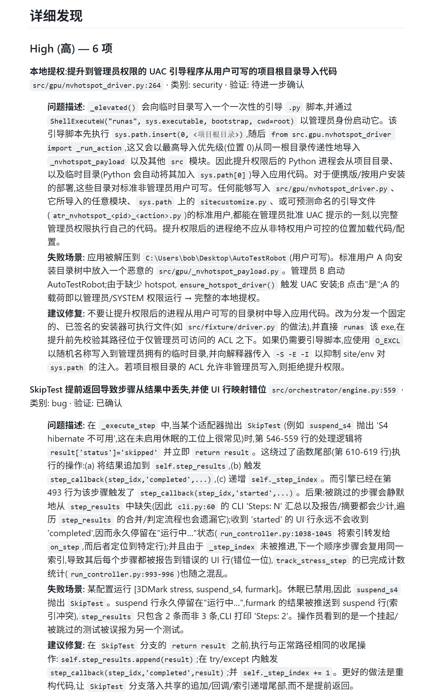

# MD Reader

本地优先、双击即开的 Markdown 阅读/轻编辑桌面应用（Tauri 2 + Vue 3）。

A4 纸张阅读视图，屏上排版与打印输出严格一致——看到什么样，打出来就是什么样。



## 下载安装

从 [Releases](https://github.com/alexroy1982/md-reader/releases) 下载最新 `MD.Reader_x64-setup.exe`，双击安装即可。

> **杀毒软件提示**：安装包未做代码签名，首次下载时部分杀软（如 Trend Micro）可能弹"发现新程序"拦截，选 **Allow Once** 放行即可；企业环境可请管理员统一加白名单。每个新版本首次下载都可能再次提示，属正常现象。

## 功能

**阅读**
- **A4 纸张视图**：210mm 纸张卡片居中、15mm 页边距，全屏不长行，4K 分屏预览也不会拉宽
- **所见即打印**：打印/导出 PDF 走 `@page A4` + 15mm 页边距，屏上线长与打印输出一致
- **精致排版**：1.72 行距、段落呼吸感、两端对齐、行内代码降噪、表格卡片式布局
- 明暗主题一键切换，目录大纲（TOC）快速跳转

**编辑**
- 分屏实时预览 + 上下滚动同步
- CodeMirror 6 语法高亮：Markdown 元素与围栏代码块（数十种常用语言）按主题自动配色
- 文档内搜索，`Ctrl-B` / `Ctrl-I` 快捷加粗、斜体

**格式支持**
- GFM、表格卡片、代码高亮（highlight.js）
- KaTeX 数学公式、Mermaid 图表（切主题自动重绘）

**文件**
- 多标签、最近文件（15 条去重置顶）、拖拽 / 双击 `.md` 关联打开
- 导出独立 HTML（内联全部样式，单文件即可分发）
- 未保存关闭拦截（标签级 / 窗口级确认弹窗）

## 开发

前置：Node 24+、Rust（rustup）、Windows 10/11（WebView2 系统自带）。

```bash
npm install
npm run tauri dev      # 桌面窗口开发模式
npm run dev            # 纯浏览器开发（文件功能不可用）
npm run test           # Vitest 单元测试
```

## 构建

```bash
npm run tauri build    # 产出 NSIS 安装包（src-tauri/target/release/bundle/nsis/）
```

> 打包请始终使用 `npm run tauri build`。直接 `cargo build --release` 产出的 exe 指向 devUrl，是不可用的废包。

## 技术栈

Tauri 2 · Vue 3 · Pinia · CodeMirror 6 · markdown-it · highlight.js · KaTeX · Mermaid

## 文档

- [产品需求文档（PRD）](PRD-Markdown阅读器.md)
