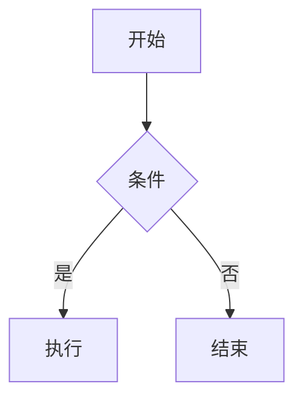

# Markdown 阅读器 v1 实现计划

> **For agentic workers:** REQUIRED SUB-SKILL: Use superpowers:subagent-driven-development (recommended) or superpowers:executing-plans to implement this plan task-by-task. Steps use checkbox (`- [ ]`) syntax for tracking.

**Goal:** 从零构建 Tauri 2 + Vue 3 本地 Markdown 阅读/轻编辑桌面应用，v1 共 13 项功能（含 KaTeX 公式与 Mermaid 图表）。

**Architecture:** Tauri 2 桌面壳（文件关联 / single-instance / fs / store / window-state 插件）；Vue 3 + Pinia 前端；CodeMirror 6 编辑器；markdown-it 插件链同步渲染公式与占位 Mermaid，Preview 挂载后懒加载 mermaid 异步渲染 SVG（内容缓存 + 并发限制 2 + 过期 token 丢弃）。

**Tech Stack:** Tauri 2 (Rust), Vue 3 + Vite + TypeScript, Pinia 3, CodeMirror 6, markdown-it 14 + KaTeX + highlight.js, mermaid 11, Tailwind CSS 4, github-markdown-css, Vitest + jsdom。

## Global Constraints

- 纯本地运行，**零联网依赖**；KaTeX 字体（woff2）本地打包，mermaid 仅动态 import（不进主包）。
- 性能：1MB 内 .md 解析+渲染 < 100ms；输入→预览延迟 < 200ms（防抖 150ms）；冷启动 < 2s；安装包 < 15MB。
- 统一 UTF-8 读写；首发 Windows 11。
- 包管理用 **npm**（Node 24 已就绪）；Rust 工具链在 Task 2 安装。
- Vitest 环境统一 **jsdom**；Tauri API 一律动态 `import()` 或 try/catch 包裹，保证纯浏览器/vitest 环境不崩。
- 每个 Task 完成后按步骤 commit；commit message 用 Conventional Commits。
- 公式定界符仅 `$...$` / `$$...$$`；Mermaid 失败 = 错误提示条 + 保留源码。
- 设计文档：`docs/superpowers/specs/2026-08-13-katex-mermaid-design.md`；PRD：`PRD-Markdown阅读器.md`。

---

### Task 1: 前端脚手架（Vite + Vue3 + TS + Tailwind v4 + Vitest）

**Files:**
- Create: `package.json`
- Create: `vite.config.ts`
- Create: `tsconfig.json`
- Create: `index.html`
- Create: `src/main.ts`
- Create: `src/App.vue`
- Create: `src/styles/main.css`
- Create: `src/smoke.test.ts`

**Interfaces:**
- Produces: `npm run dev`（端口 1420）、`npm run test`、路径别名 `@/` → `src/`。后续所有任务依赖。

- [ ] **Step 1: 写 `package.json`**

```json
{
  "name": "md-reader",
  "private": true,
  "version": "0.1.0",
  "type": "module",
  "scripts": {
    "dev": "vite",
    "build": "vite build",
    "preview": "vite preview",
    "test": "vitest run",
    "tauri": "tauri"
  },
  "dependencies": {
    "@codemirror/commands": "^6.6.0",
    "@codemirror/lang-markdown": "^6.2.5",
    "@codemirror/language": "^6.10.0",
    "@codemirror/search": "^6.5.6",
    "@codemirror/state": "^6.4.1",
    "@codemirror/view": "^6.28.0",
    "@tauri-apps/api": "^2.0.0",
    "@tauri-apps/plugin-dialog": "^2.0.0",
    "@tauri-apps/plugin-fs": "^2.0.0",
    "@tauri-apps/plugin-store": "^2.0.0",
    "github-markdown-css": "^5.5.1",
    "highlight.js": "^11.9.0",
    "katex": "^0.16.9",
    "markdown-it": "^14.1.0",
    "mermaid": "^11.4.0",
    "pinia": "^3.0.0",
    "vue": "^3.5.0"
  },
  "devDependencies": {
    "@tailwindcss/vite": "^4.0.0",
    "@tauri-apps/cli": "^2.0.0",
    "@types/markdown-it": "^14.0.0",
    "@vitejs/plugin-vue": "^5.2.0",
    "jsdom": "^25.0.0",
    "tailwindcss": "^4.0.0",
    "typescript": "~5.6.2",
    "vite": "^6.0.0",
    "vitest": "^3.0.0"
  }
}
```

- [ ] **Step 2: 写 `vite.config.ts`**

```ts
/// <reference types="vitest/config" />
import { defineConfig } from 'vite'
import vue from '@vitejs/plugin-vue'
import tailwindcss from '@tailwindcss/vite'
import { fileURLToPath, URL } from 'node:url'

export default defineConfig({
  plugins: [vue(), tailwindcss()],
  resolve: {
    alias: { '@': fileURLToPath(new URL('./src', import.meta.url)) },
  },
  clearScreen: false,
  server: { port: 1420, strictPort: true },
  build: { chunkSizeWarningLimit: 3000 },
  test: { environment: 'jsdom' },
})
```

- [ ] **Step 3: 写 `tsconfig.json`**

```json
{
  "compilerOptions": {
    "target": "ES2022",
    "module": "ESNext",
    "moduleResolution": "bundler",
    "strict": true,
    "jsx": "preserve",
    "resolveJsonModule": true,
    "esModuleInterop": true,
    "skipLibCheck": true,
    "noEmit": true,
    "lib": ["ES2022", "DOM", "DOM.Iterable"],
    "types": ["vite/client"],
    "baseUrl": ".",
    "paths": { "@/*": ["src/*"] }
  },
  "include": ["src/**/*.ts", "src/**/*.vue", "vite.config.ts"]
}
```

- [ ] **Step 4: 写 `index.html` / `src/main.ts` / `src/App.vue` / `src/styles/main.css` / `src/smoke.test.ts`**

`index.html`:
```html
<!DOCTYPE html>
<html lang="zh-CN" data-theme="light">
  <head>
    <meta charset="UTF-8" />
    <meta name="viewport" content="width=device-width, initial-scale=1.0" />
    <title>MD Reader</title>
  </head>
  <body>
    <div id="app"></div>
    <script type="module" src="/src/main.ts"></script>
  </body>
</html>
```

`src/main.ts`:
```ts
import { createApp } from 'vue'
import { createPinia } from 'pinia'
import App from './App.vue'
import './styles/main.css'

createApp(App).use(createPinia()).mount('#app')
```

`src/App.vue`（骨架，Task 11 替换为完整布局）:
```vue
<template>
  <div class="p-4">MD Reader 脚手架就绪</div>
</template>
```

`src/styles/main.css`:
```css
@import "tailwindcss";
@import "./theme.css";
@import "./markdown.css";

html, body, #app {
  height: 100%;
  margin: 0;
}

body {
  background: var(--bg-app);
  color: var(--text-primary);
  font-family: "Segoe UI", "Microsoft YaHei", system-ui, sans-serif;
}
```

`src/smoke.test.ts`:
```ts
import { describe, it, expect } from 'vitest'

describe('scaffold', () => {
  it('vitest works', () => {
    expect(1 + 1).toBe(2)
  })
})
```

- [ ] **Step 5: 创建空的样式占位文件**

创建 `src/styles/theme.css` 和 `src/styles/markdown.css`，内容均为一行注释：
```css
/* Task 8 填充主题变量 */
```
```css
/* Task 10 填充渲染区样式 */
```

- [ ] **Step 6: 安装依赖并验证**

Run: `npm install`
Expected: 成功无报错（mermaid/katex 较大，耐心等待）。

Run: `npm run test`
Expected: PASS（1 个 smoke test）

Run: `npm run dev`（后台运行，然后 `curl -s http://localhost:1420 | findstr "MD Reader"` 有输出后 Ctrl+C 停止）
Expected: dev server 启动，页面可访问。

- [ ] **Step 7: Commit**

```bash
git add -A
git commit -m "chore: Vite + Vue3 + TS + Tailwind v4 + Vitest 前端脚手架"
```

---

### Task 2: Rust 工具链 + Tauri 2 脚手架

**Files:**
- Create: `src-tauri/Cargo.toml`
- Create: `src-tauri/tauri.conf.json`
- Create: `src-tauri/build.rs`
- Create: `src-tauri/src/main.rs`
- Create: `src-tauri/src/lib.rs`
- Create: `src-tauri/capabilities/default.json`
- Create: `scripts/gen-icon.mjs`
- Create: `src-tauri/icons/`（由脚本 + tauri cli 生成）

**Interfaces:**
- Produces: `npm run tauri dev` 可打开桌面窗口；`open-file` 事件名（前端 App 监听，payload 为文件绝对路径 string）；`frontend-ready` 事件名（前端启动后 emit，Rust 收到后才发首个 `open-file`）。Task 13 在此之上补插件接线。

- [ ] **Step 1: 安装 Rust 工具链（需要用户确认的一步）**

Run: `winget install --id Rustlang.Rustup -e --accept-source-agreements --accept-package-agreements`

安装后**重开终端**（或 `$env:Path = [System.Environment]::GetEnvironmentVariable("Path","Machine") + ";" + [System.Environment]::GetEnvironmentVariable("Path","User")`），然后：

Run: `rustc --version && cargo --version`
Expected: 输出版本号（≥ 1.77）。

若后续链接报错（`link.exe not found`），需安装 Visual Studio Build Tools 2022（C++ 工作负载）：
`winget install --id Microsoft.VisualStudio.2022.BuildTools -e --override "--add Microsoft.VisualStudio.Workload.VCTools --includeRecommended"`

- [ ] **Step 2: 写 `src-tauri/Cargo.toml`**

```toml
[package]
name = "md-reader"
version = "0.1.0"
edition = "2021"

[lib]
name = "md_reader_lib"
crate-type = ["staticlib", "cdylib", "rlib"]

[build-dependencies]
tauri-build = { version = "2", features = [] }

[dependencies]
tauri = { version = "2", features = [] }
tauri-plugin-single-instance = "2"
tauri-plugin-store = "2"
tauri-plugin-fs = "2"
tauri-plugin-dialog = "2"
tauri-plugin-window-state = "2"
serde = { version = "1", features = ["derive"] }
serde_json = "1"
```

- [ ] **Step 3: 写 `src-tauri/build.rs` / `src-tauri/src/main.rs`**

`build.rs`:
```rust
fn main() {
    tauri_build::build()
}
```

`src/main.rs`:
```rust
#![cfg_attr(not(debug_assertions), windows_subsystem = "windows")]

fn main() {
    md_reader_lib::run()
}
```

- [ ] **Step 4: 写 `src-tauri/src/lib.rs`（最小可运行版，Task 13 扩展插件）**

```rust
#[cfg_attr(mobile, tauri::mobile_entry_point)]
pub fn run() {
    tauri::Builder::default()
        .run(tauri::generate_context!())
        .expect("error while running tauri application");
}
```

- [ ] **Step 5: 写 `src-tauri/tauri.conf.json`**

```json
{
  "$schema": "https://schema.tauri.app/config/2",
  "productName": "MD Reader",
  "version": "0.1.0",
  "identifier": "com.local.mdreader",
  "build": {
    "beforeDevCommand": "npm run dev",
    "devUrl": "http://localhost:1420",
    "beforeBuildCommand": "npm run build",
    "frontendDist": "../dist"
  },
  "app": {
    "windows": [
      {
        "label": "main",
        "title": "MD Reader",
        "width": 1280,
        "height": 800,
        "minWidth": 800,
        "minHeight": 500
      }
    ],
    "fileAssociations": [
      {
        "ext": ["md"],
        "name": "Markdown Document",
        "description": "Markdown document",
        "role": "Viewer"
      },
      {
        "ext": ["markdown"],
        "name": "Markdown Document",
        "description": "Markdown document",
        "role": "Viewer"
      }
    ],
    "security": { "csp": null }
  },
  "bundle": {
    "active": true,
    "targets": ["nsis"],
    "icon": [
      "icons/32x32.png",
      "icons/128x128.png",
      "icons/128x128@2x.png",
      "icons/icon.ico"
    ]
  }
}
```

注意：`"csp": null` 是有意的——mermaid 渲染的 SVG 与 KaTeX 输出含内联样式，默认 CSP 会拦截。纯本地应用风险可接受。

- [ ] **Step 6: 写 `src-tauri/capabilities/default.json`**

```json
{
  "$schema": "../gen/schemas/desktop-schema.json",
  "identifier": "default",
  "description": "Default capability set for the main window",
  "windows": ["main"],
  "permissions": [
    "core:default",
    "core:window:allow-set-focus",
    "core:window:allow-unminimize",
    "dialog:allow-open",
    "dialog:allow-save",
    "fs:allow-read-text-file",
    "fs:allow-write-text-file",
    { "identifier": "fs:scope", "allow": ["**"] },
    "store:default",
    "window-state:default"
  ]
}
```

- [ ] **Step 7: 生成图标**

写 `scripts/gen-icon.mjs`（生成 1024×1024 纯色 PNG 源图，不依赖任何包）：

```js
import zlib from 'node:zlib'
import fs from 'node:fs'

const SIZE = 1024
// CRC32
const table = Array.from({ length: 256 }, (_, n) => {
  let c = n
  for (let k = 0; k < 8; k++) c = c & 1 ? 0xedb88320 ^ (c >>> 1) : c >>> 1
  return c >>> 0
})
function crc32(buf) {
  let c = 0xffffffff
  for (const b of buf) c = table[(c ^ b) & 0xff] ^ (c >>> 8)
  return (c ^ 0xffffffff) >>> 0
}
function chunk(type, data) {
  const out = Buffer.alloc(12 + data.length)
  out.writeUInt32BE(data.length, 0)
  out.write(type, 4)
  data.copy(out, 8)
  out.writeUInt32BE(crc32(out.subarray(4, 8 + data.length)), 8 + data.length)
  return out
}
// 像素：深蓝底色 #0969da，中央白色 "M" 用简单矩形拼出
const raw = Buffer.alloc(SIZE * (SIZE * 4 + 1))
for (let y = 0; y < SIZE; y++) {
  const row = y * (SIZE * 4 + 1)
  raw[row] = 0 // filter: none
  for (let x = 0; x < SIZE; x++) {
    const o = row + 1 + x * 4
    let r = 9, g = 105, b = 218 // #0969da
    const inM =
      (x > 300 && x < 380 && y > 300 && y < 724) ||
      (x > 644 && x < 724 && y > 300 && y < 724) ||
      (x >= 380 && x < 512 && y > 300 && y < 300 + (x - 380) + 80 && y < 560) ||
      (x >= 512 && x < 644 && y > 300 && y < 300 + (644 - x) + 80 && y < 560)
    if (inM) { r = 255; g = 255; b = 255 }
    raw[o] = r; raw[o + 1] = g; raw[o + 2] = b; raw[o + 3] = 255
  }
}
const ihdr = Buffer.alloc(13)
ihdr.writeUInt32BE(SIZE, 0)
ihdr.writeUInt32BE(SIZE, 4)
ihdr[8] = 8; ihdr[9] = 6 // 8-bit RGBA
const png = Buffer.concat([
  Buffer.from([0x89, 0x50, 0x4e, 0x47, 0x0d, 0x0a, 0x1a, 0x0a]),
  chunk('IHDR', ihdr),
  chunk('IDAT', zlib.deflateSync(raw, { level: 9 })),
  chunk('IEND', Buffer.alloc(0)),
])
fs.mkdirSync('src-tauri/icons', { recursive: true })
fs.writeFileSync('src-tauri/icons/app-icon-source.png', png)
console.log('written src-tauri/icons/app-icon-source.png')
```

Run: `node scripts/gen-icon.mjs && npx @tauri-apps/cli icon src-tauri/icons/app-icon-source.png -o src-tauri/icons`
Expected: 生成 `32x32.png`、`128x128.png`、`128x128@2x.png`、`icon.ico` 等。

- [ ] **Step 8: 验证 Tauri 编译运行**

Run: `npm run tauri dev`（后台运行；首次编译 Rust 依赖需 3-10 分钟）
Expected: 编译成功，弹出 "MD Reader" 窗口显示脚手架文本。验证后关闭。

若权限/schema 报错，按报错修正 `capabilities/default.json`（Tauri 2 报错信息会指出缺失的 permission 名）。

- [ ] **Step 9: Commit**

```bash
git add -A
git commit -m "chore: Tauri 2 脚手架（文件关联配置 + 图标 + capabilities）"
```

---

### Task 3: 类型定义 + useMarkdown 核心链（GFM + highlight.js + TOC 锚点）

**Files:**
- Create: `src/types/index.ts`
- Create: `src/lib/markdown/tocPlugin.ts`
- Create: `src/composables/useMarkdown.ts`
- Test: `src/lib/markdown/tocPlugin.test.ts`
- Test: `src/composables/useMarkdown.test.ts`

**Interfaces:**
- Produces（后续任务依赖，签名固定）:
  - `interface TocItem { level: 1 | 2 | 3; text: string; slug: string }`
  - `interface RenderResult { html: string; toc: TocItem[] }`
  - `interface Tab { id: string; title: string; path: string | null; content: string; savedContent: string }`
  - `type Theme = 'light' | 'dark'`
  - `interface RecentFile { path: string; name: string; openedAt: number }`
  - `renderMarkdown(src: string): RenderResult` — 解析异常时**抛给调用方**（Preview 负责 try/catch 保留上一帧）。
  - `slugify(text: string): string`

- [ ] **Step 1: 写 `src/types/index.ts`**

```ts
export interface TocItem {
  level: 1 | 2 | 3
  text: string
  slug: string
}

export interface RenderResult {
  html: string
  toc: TocItem[]
}

export interface Tab {
  id: string
  title: string
  path: string | null
  content: string
  savedContent: string
}

export type Theme = 'light' | 'dark'

export interface RecentFile {
  path: string
  name: string
  openedAt: number
}
```

- [ ] **Step 2: 写失败测试 `src/lib/markdown/tocPlugin.test.ts`**

```ts
import { describe, it, expect } from 'vitest'
import MarkdownIt from 'markdown-it'
import { tocPlugin, slugify } from './tocPlugin'
import type { TocItem } from '@/types'

function parse(src: string): { html: string; toc: TocItem[] } {
  const md = new MarkdownIt()
  md.use(tocPlugin)
  const env: { toc?: TocItem[] } = {}
  const html = md.render(src, env)
  return { html, toc: env.toc ?? [] }
}

describe('slugify', () => {
  it('转小写、空格转连字符', () => {
    expect(slugify('Hello World')).toBe('hello-world')
  })
  it('保留中文', () => {
    expect(slugify('第二章 快速上手')).toBe('第二章-快速上手')
  })
  it('去掉标点符号', () => {
    expect(slugify('What is this?')).toBe('what-is-this')
  })
})

describe('tocPlugin', () => {
  it('收集 H1-H3，忽略 H4', () => {
    const { toc } = parse('# A\n## B\n### C\n#### D')
    expect(toc.map((t) => t.text)).toEqual(['A', 'B', 'C'])
    expect(toc.map((t) => t.level)).toEqual([1, 2, 3])
  })
  it('给标题注入 id 锚点', () => {
    const { html } = parse('# Hello World')
    expect(html).toContain('<h1 id="hello-world">')
  })
  it('重复标题 slug 去重加后缀', () => {
    const { toc } = parse('# Intro\n# Intro')
    expect(toc[0].slug).toBe('intro')
    expect(toc[1].slug).toBe('intro-1')
  })
})
```

- [ ] **Step 3: 运行测试确认失败**

Run: `npm run test -- tocPlugin`
Expected: FAIL（模块不存在）

- [ ] **Step 4: 实现 `src/lib/markdown/tocPlugin.ts`**

```ts
import type MarkdownIt from 'markdown-it'
import type StateCore from 'markdown-it/lib/rules_core/state_core.mjs'
import type { TocItem } from '@/types'

export function slugify(text: string): string {
  return text
    .trim()
    .toLowerCase()
    .replace(/[^\p{L}\p{N}\s_-]/gu, '')
    .replace(/\s+/g, '-')
}

export function tocPlugin(md: MarkdownIt): void {
  md.core.ruler.push('toc_collect', (state: StateCore) => {
    const env = state.env as { toc?: TocItem[] }
    const toc: TocItem[] = []
    const seen = new Map<string, number>()
    const tokens = state.tokens
    for (let i = 0; i < tokens.length; i++) {
      const t = tokens[i]
      if (t.type !== 'heading_open') continue
      if (t.tag !== 'h1' && t.tag !== 'h2' && t.tag !== 'h3') continue
      const inline = tokens[i + 1]
      const text = inline && inline.type === 'inline' ? inline.content : ''
      const base = slugify(text) || 'section'
      const n = seen.get(base) ?? 0
      seen.set(base, n + 1)
      const slug = n === 0 ? base : `${base}-${n}`
      t.attrSet('id', slug)
      toc.push({ level: Number(t.tag[1]) as 1 | 2 | 3, text, slug })
    }
    env.toc = toc
    return false
  })
}
```

- [ ] **Step 5: 运行测试确认通过**

Run: `npm run test -- tocPlugin`
Expected: PASS（6 个用例）

- [ ] **Step 6: 写失败测试 `src/composables/useMarkdown.test.ts`（GFM 与高亮）**

```ts
import { describe, it, expect } from 'vitest'
import { renderMarkdown } from './useMarkdown'

describe('renderMarkdown GFM', () => {
  it('渲染表格', () => {
    const { html } = renderMarkdown('| a | b |\n|---|---|\n| 1 | 2 |')
    expect(html).toContain('<table>')
    expect(html).toContain('<td>1</td>')
  })
  it('渲染删除线', () => {
    const { html } = renderMarkdown('~~gone~~')
    expect(html).toContain('<s>gone</s>')
  })
  it('自动链接', () => {
    const { html } = renderMarkdown('see https://example.com now')
    expect(html).toContain('href="https://example.com"')
  })
  it('转义原始 HTML（安全）', () => {
    const { html } = renderMarkdown('<script>alert(1)</script>')
    expect(html).not.toContain('<script>')
  })
})

describe('renderMarkdown 代码高亮', () => {
  it('js 代码块带 hljs class', () => {
    const { html } = renderMarkdown('```js\nconst a = 1\n```')
    expect(html).toContain('hljs')
  })
})

describe('renderMarkdown TOC', () => {
  it('返回 toc 数组', () => {
    const { toc } = renderMarkdown('# 标题一\n## 小节')
    expect(toc).toEqual([
      { level: 1, text: '标题一', slug: '标题一' },
      { level: 2, text: '小节', slug: '小节' },
    ])
  })
})
```

- [ ] **Step 7: 运行测试确认失败**

Run: `npm run test -- useMarkdown`
Expected: FAIL（模块不存在）

- [ ] **Step 8: 实现 `src/composables/useMarkdown.ts`**

```ts
import MarkdownIt from 'markdown-it'
import hljs from 'highlight.js'
import { tocPlugin } from '@/lib/markdown/tocPlugin'
import { katexPlugin } from '@/lib/markdown/katexPlugin'
import { taskListsPlugin } from '@/lib/markdown/taskListsPlugin'
import { mermaidPlugin } from '@/lib/markdown/mermaidPlugin'
import type { RenderResult, TocItem } from '@/types'

const md: MarkdownIt = new MarkdownIt({
  html: false, // 安全：不渲染原始 HTML
  linkify: true,
  breaks: false,
  highlight(str: string, lang: string): string {
    if (lang && hljs.getLanguage(lang)) {
      try {
        return hljs.highlight(str, { language: lang }).value
      } catch {
        // fall through：高亮失败时按纯文本转义输出
      }
    }
    return ''
  },
})

md.use(katexPlugin)
md.use(taskListsPlugin)
md.use(mermaidPlugin)
md.use(tocPlugin)

export function renderMarkdown(src: string): RenderResult {
  const env: { toc?: TocItem[] } = {}
  const html = md.render(src, env)
  return { html, toc: env.toc ?? [] }
}
```

注意：`katexPlugin` / `taskListsPlugin` / `mermaidPlugin` 在 Task 4/5 才实现。本任务先建三个存根文件让测试通过，Task 4/5 再用 TDD 充实：

`src/lib/markdown/katexPlugin.ts` 存根：
```ts
import type MarkdownIt from 'markdown-it'
// Task 4 实现公式规则
export function katexPlugin(_md: MarkdownIt): void {}
```

`src/lib/markdown/taskListsPlugin.ts` 存根：
```ts
import type MarkdownIt from 'markdown-it'
// Task 5 实现任务列表
export function taskListsPlugin(_md: MarkdownIt): void {}
```

`src/lib/markdown/mermaidPlugin.ts` 存根：
```ts
import type MarkdownIt from 'markdown-it'
// Task 5 实现 mermaid 占位
export function mermaidPlugin(_md: MarkdownIt): void {}
```

- [ ] **Step 9: 运行全部测试确认通过**

Run: `npm run test`
Expected: PASS

- [ ] **Step 10: Commit**

```bash
git add -A
git commit -m "feat: markdown 渲染核心链（GFM + highlight.js + TOC 锚点插件）"
```

---

### Task 4: KaTeX 公式插件（$ 行内 / $$ 块级）

**Files:**
- Modify: `src/lib/markdown/katexPlugin.ts`（存根 → 完整实现）
- Test: `src/lib/markdown/katexPlugin.test.ts`

**Interfaces:**
- Consumes: `renderMarkdown`（Task 3）自动获得公式能力。
- Produces: `katexPlugin(md: MarkdownIt): void`；输出 DOM：行内 `<span class="math math-inline">…katex…</span>`，块级 `<div class="math math-block">…</div>`。Task 10 的 CSS 与 Task 15 的导出依赖这两个 class 名。

- [ ] **Step 1: 写失败测试 `src/lib/markdown/katexPlugin.test.ts`**

```ts
import { describe, it, expect } from 'vitest'
import { renderMarkdown } from '@/composables/useMarkdown'

describe('katexPlugin 行内公式', () => {
  it('$E=mc^2$ 渲染为 span.math-inline', () => {
    const { html } = renderMarkdown('质能方程 $E=mc^2$ 著名')
    expect(html).toContain('class="math math-inline"')
    expect(html).toContain('katex')
  })
  it('货币 $5 和 $6 不误判（$ 后/前是空格）', () => {
    const { html } = renderMarkdown('苹果 $5 和香蕉 $6 各一斤')
    expect(html).not.toContain('math-inline')
  })
  it('转义 \\$ 不触发公式', () => {
    const { html } = renderMarkdown('价格 \\$100 元')
    expect(html).not.toContain('math-inline')
  })
  it('公式语法错误渲染红色错误而非崩溃', () => {
    const { html } = renderMarkdown('$\\frac{1$')
    expect(html).toContain('katex-error')
  })
})

describe('katexPlugin 块级公式', () => {
  it('多行 $$ 块渲染为 div.math-block', () => {
    const { html } = renderMarkdown('$$\nE = mc^2\n$$')
    expect(html).toContain('class="math math-block"')
  })
  it('独占一行的 $$x^2$$ 渲染为块级', () => {
    const { html } = renderMarkdown('$$x^2 + y^2 = z^2$$')
    expect(html).toContain('math-block')
  })
})
```

- [ ] **Step 2: 运行测试确认失败**

Run: `npm run test -- katexPlugin`
Expected: FAIL（存根不产出公式）

- [ ] **Step 3: 实现 `src/lib/markdown/katexPlugin.ts`（替换存根）**

```ts
import type MarkdownIt from 'markdown-it'
import type StateInline from 'markdown-it/lib/rules_inline/state_inline.mjs'
import type StateBlock from 'markdown-it/lib/rules_block/state_block.mjs'
import katex from 'katex'

const DOLLAR = 0x24 // $
const BACKSLASH = 0x5c // \

function renderKatex(src: string, displayMode: boolean): string {
  return katex.renderToString(src, {
    displayMode,
    throwOnError: false,
    output: 'html',
  })
}

// 行内规则：$...$ 与 $$...$$（同段内）
function mathInline(state: StateInline, silent: boolean): boolean {
  const start = state.pos
  if (state.src.charCodeAt(start) !== DOLLAR) return false
  if (start > 0 && state.src.charCodeAt(start - 1) === BACKSLASH) return false

  const isDouble = state.src.charCodeAt(start + 1) === DOLLAR
  const openLen = isDouble ? 2 : 1
  const afterOpen = state.src.charAt(start + openLen)
  // 开符号后紧跟空白或结尾 → 不是公式（避免 "$5 和 $6" 误判）
  if (afterOpen === '' || afterOpen === ' ' || afterOpen === '\n') return false

  const closer = isDouble ? '$$' : '$'
  let scan = start + openLen
  let closePos = -1
  while ((scan = state.src.indexOf(closer, scan)) !== -1) {
    if (state.src.charCodeAt(scan - 1) === BACKSLASH) {
      scan += closer.length
      continue
    }
    if (!isDouble) {
      const before = state.src.charAt(scan - 1)
      if (before === ' ' || before === '\n') {
        scan += 1
        continue
      }
    }
    closePos = scan
    break
  }
  if (closePos === -1) return false

  const content = state.src.slice(start + openLen, closePos)
  if (content.trim() === '') return false
  if (!isDouble && content.includes('\n')) return false

  if (!silent) {
    const token = state.push('math_inline', '', 0)
    token.content = content
    token.markup = closer
    token.meta = { displayMode: isDouble }
  }
  state.pos = closePos + openLen
  return true
}

// 块级规则：独占段落的 $$...$$（单行或多行）
function mathBlock(state: StateBlock, startLine: number, endLine: number, silent: boolean): boolean {
  const startPos = state.bMarks[startLine] + state.tShift[startLine]
  const maxPos = state.eMarks[startLine]
  if (startPos + 1 >= maxPos) return false
  if (state.src.charCodeAt(startPos) !== DOLLAR) return false
  if (state.src.charCodeAt(startPos + 1) !== DOLLAR) return false

  // 单行形式：$$...$$ 且行尾无其他内容
  const firstLineRest = state.src.slice(startPos + 2, maxPos)
  const inlineClose = firstLineRest.indexOf('$$')
  if (inlineClose !== -1 && firstLineRest.slice(inlineClose + 2).trim() === '') {
    if (silent) return true
    const token = state.push('math_block', '', 0)
    token.block = true
    token.content = firstLineRest.slice(0, inlineClose)
    token.map = [startLine, startLine + 1]
    state.line = startLine + 1
    return true
  }

  // 多行形式：寻找内容仅为 $$ 的收尾行
  let closeLine = -1
  for (let line = startLine + 1; line < endLine; line++) {
    const pos = state.bMarks[line] + state.tShift[line]
    const max = state.eMarks[line]
    if (state.src.slice(pos, max).trim() === '$$') {
      closeLine = line
      break
    }
  }
  if (closeLine === -1) return false
  if (silent) return true

  const content = state.src.slice(startPos + 2, state.bMarks[closeLine])
  const token = state.push('math_block', '', 0)
  token.block = true
  token.content = content
  token.map = [startLine, closeLine + 1]
  state.line = closeLine + 1
  return true
}

export function katexPlugin(md: MarkdownIt): void {
  md.inline.ruler.after('escape', 'math_inline', mathInline)
  md.block.ruler.before('fence', 'math_block', mathBlock)

  md.renderer.rules.math_inline = (tokens, idx) =>
    `<span class="math math-inline">${renderKatex(tokens[idx].content, tokens[idx].meta?.displayMode === true)}</span>`

  md.renderer.rules.math_block = (tokens, idx) =>
    `<div class="math math-block">${renderKatex(tokens[idx].content, true)}</div>\n`
}
```

- [ ] **Step 4: 运行测试确认通过**

Run: `npm run test -- katexPlugin`
Expected: PASS（6 个用例）

注意：`katex-error` 的 class 由 KaTeX `throwOnError: false` 输出，测试依赖它——不要改 KaTeX 配置。

- [ ] **Step 5: Commit**

```bash
git add -A
git commit -m "feat: KaTeX 公式插件（\$ 行内 / \$\$ 块级，错误红色渲染不崩溃）"
```

---

### Task 5: 任务列表插件 + Mermaid 占位插件

**Files:**
- Modify: `src/lib/markdown/taskListsPlugin.ts`（存根 → 实现）
- Modify: `src/lib/markdown/mermaidPlugin.ts`（存根 → 实现）
- Test: `src/lib/markdown/plugins.test.ts`

**Interfaces:**
- Produces:
  - 任务列表输出 `<li class="task-list-item"><input type="checkbox" disabled[ checked]> …`（github-markdown-css 识别 `task-list-item`）。
  - Mermaid 输出 `<div class="mermaid-placeholder"><pre class="mermaid-source">转义后的图源码</pre></div>`——`useMermaid`（Task 6）按这两个 class 名工作。

- [ ] **Step 1: 写失败测试 `src/lib/markdown/plugins.test.ts`**

```ts
import { describe, it, expect } from 'vitest'
import { renderMarkdown } from '@/composables/useMarkdown'

describe('taskListsPlugin', () => {
  it('- [ ] 渲染未勾选 checkbox', () => {
    const { html } = renderMarkdown('- [ ] 待办事项')
    expect(html).toContain('type="checkbox"')
    expect(html).toContain('task-list-item')
    expect(html).not.toContain('checked')
  })
  it('- [x] 渲染已勾选 checkbox', () => {
    const { html } = renderMarkdown('- [x] 已完成')
    expect(html).toContain('checked')
  })
  it('普通列表不受影响', () => {
    const { html } = renderMarkdown('- 普通项目')
    expect(html).not.toContain('checkbox')
  })
})

describe('mermaidPlugin', () => {
  it('```mermaid 块输出占位符并携带转义源码', () => {
    const { html } = renderMarkdown('```mermaid\ngraph TD\n  A-->B\n```')
    expect(html).toContain('class="mermaid-placeholder"')
    expect(html).toContain('class="mermaid-source"')
    expect(html).toContain('A--&gt;B')
  })
  it('普通代码块仍走 highlight.js', () => {
    const { html } = renderMarkdown('```js\nlet x = 1\n```')
    expect(html).toContain('hljs')
    expect(html).not.toContain('mermaid-placeholder')
  })
  it('源码中的 < 被转义', () => {
    const { html } = renderMarkdown('```mermaid\ngraph TD\n  A["<b>hi</b>"]\n```')
    expect(html).toContain('&lt;b&gt;')
    expect(html).not.toContain('<b>hi</b>')
  })
})
```

- [ ] **Step 2: 运行测试确认失败**

Run: `npm run test -- plugins`
Expected: FAIL

- [ ] **Step 3: 实现 `src/lib/markdown/taskListsPlugin.ts`（替换存根）**

```ts
import type MarkdownIt from 'markdown-it'
import type StateCore from 'markdown-it/lib/rules_core/state_core.mjs'

// 结构：bullet_list_open > list_item_open > paragraph_open > inline > children[0]=text
export function taskListsPlugin(md: MarkdownIt): void {
  md.core.ruler.push('task_lists', (state: StateCore) => {
    const tokens = state.tokens
    for (let i = 2; i < tokens.length; i++) {
      const inline = tokens[i]
      if (inline.type !== 'inline') continue
      if (tokens[i - 1].type !== 'paragraph_open') continue
      if (tokens[i - 2].type !== 'list_item_open') continue
      const first = inline.children?.[0]
      if (!first || first.type !== 'text') continue
      const m = /^\[([ xX])\]\s+/.exec(first.content)
      if (!m) continue
      const checked = m[1].toLowerCase() === 'x'
      first.content = first.content.slice(m[0].length)
      const checkbox = new state.Token('task_checkbox', 'input', 0)
      checkbox.meta = { checked }
      inline.children!.unshift(checkbox)
      tokens[i - 2].attrJoin('class', 'task-list-item')
    }
    return false
  })

  md.renderer.rules.task_checkbox = (tokens, idx) =>
    `<input type="checkbox" disabled${tokens[idx].meta?.checked ? ' checked' : ''}> `
}
```

- [ ] **Step 4: 实现 `src/lib/markdown/mermaidPlugin.ts`（替换存根）**

```ts
import type MarkdownIt from 'markdown-it'

export function mermaidPlugin(md: MarkdownIt): void {
  const defaultFence = md.renderer.rules.fence!
  md.renderer.rules.fence = (tokens, idx, options, env, self) => {
    const token = tokens[idx]
    if (token.info.trim().toLowerCase() === 'mermaid') {
      const source = md.utils.escapeHtml(token.content)
      return `<div class="mermaid-placeholder"><pre class="mermaid-source">${source}</pre></div>\n`
    }
    return defaultFence(tokens, idx, options, env, self)
  }
}
```

- [ ] **Step 5: 运行测试确认通过**

Run: `npm run test`
Expected: PASS（全部）

- [ ] **Step 6: Commit**

```bash
git add -A
git commit -m "feat: 任务列表 checkbox + Mermaid 占位 fence 插件"
```

---

### Task 6: useMermaid 组合式函数（懒加载 / 缓存 / 并发 / 过期丢弃 / 错误条）

**Files:**
- Create: `src/composables/useMermaid.ts`
- Test: `src/composables/useMermaid.test.ts`

**Interfaces:**
- Consumes: Task 5 的 `.mermaid-placeholder` / `.mermaid-source` DOM 结构；`Theme` 类型。
- Produces:
  - `renderMermaidBlocks(root: HTMLElement, theme: Theme): Promise<void>` — 渲染 root 下所有占位符；并发上限 2；重复调用时旧调用的 DOM 写入被丢弃（结果仍进缓存）。
  - `resetMermaidForTests(): void` — 仅测试用。
  - 渲染成功：占位符 innerHTML → `<div class="mermaid-diagram">SVG</div>` 并加 class `mermaid-rendered`。
  - 渲染失败：innerHTML → `<div class="mermaid-error-bar">Mermaid 渲染失败：…</div><pre class="mermaid-source mermaid-source-visible">源码</pre>` 并加 class `mermaid-failed`。Task 10 的 CSS 依赖这些 class。

- [ ] **Step 1: 写失败测试 `src/composables/useMermaid.test.ts`**

```ts
import { describe, it, expect, vi, beforeEach } from 'vitest'

// 注意：vitest 要求 vi.mock 工厂引用的外部变量以 mock 开头
const mockMermaidRender = vi.fn()

vi.mock('mermaid', () => ({
  default: {
    initialize: vi.fn(),
    render: (...args: unknown[]) => mockMermaidRender(...args),
  },
}))

import { renderMermaidBlocks, resetMermaidForTests } from './useMermaid'

function makeRoot(sources: string[]): HTMLElement {
  const root = document.createElement('div')
  for (const src of sources) {
    const div = document.createElement('div')
    div.className = 'mermaid-placeholder'
    const pre = document.createElement('pre')
    pre.className = 'mermaid-source'
    pre.textContent = src
    div.appendChild(pre)
    root.appendChild(div)
  }
  document.body.appendChild(root) // isConnected 为 true 才会写入 DOM
  return root
}

beforeEach(() => {
  resetMermaidForTests()
  mockMermaidRender.mockReset()
  document.body.innerHTML = ''
})

describe('renderMermaidBlocks', () => {
  it('渲染成功：占位符替换为 SVG（源码保留在隐藏 pre 中）', async () => {
    mockMermaidRender.mockResolvedValue({ svg: '<svg>ok</svg>' })
    const root = makeRoot(['graph TD\nA-->B'])
    await renderMermaidBlocks(root, 'light')
    expect(root.querySelector('.mermaid-diagram')?.innerHTML).toContain('<svg>')
    expect(root.querySelector('.mermaid-diagram')?.textContent).toContain('ok')
    expect(root.querySelector('.mermaid-placeholder')?.classList.contains('mermaid-rendered')).toBe(true)
    // 源码必须保留（主题切换重渲染依赖它）
    expect(root.querySelector('.mermaid-source')?.textContent).toBe('graph TD\nA-->B')
  })

  it('渲染失败：错误条 + 保留源码', async () => {
    mockMermaidRender.mockRejectedValue(new Error('Parse error on line 2'))
    const root = makeRoot(['not a diagram'])
    await renderMermaidBlocks(root, 'light')
    const bar = root.querySelector('.mermaid-error-bar')
    expect(bar?.textContent).toContain('Parse error on line 2')
    expect(root.querySelector('.mermaid-source-visible')?.textContent).toBe('not a diagram')
  })

  it('相同内容+主题命中缓存，不重复调用 render', async () => {
    mockMermaidRender.mockResolvedValue({ svg: '<svg>x</svg>' })
    const root1 = makeRoot(['graph TD\nA-->B'])
    await renderMermaidBlocks(root1, 'light')
    const root2 = makeRoot(['graph TD\nA-->B'])
    await renderMermaidBlocks(root2, 'light')
    expect(mockMermaidRender).toHaveBeenCalledTimes(1)
  })

  it('主题不同则缓存 key 不同，会重新渲染', async () => {
    mockMermaidRender.mockResolvedValue({ svg: '<svg>x</svg>' })
    await renderMermaidBlocks(makeRoot(['graph TD\nA-->B']), 'light')
    await renderMermaidBlocks(makeRoot(['graph TD\nA-->B']), 'dark')
    expect(mockMermaidRender).toHaveBeenCalledTimes(2)
  })

  it('过期 token 的结果不写入 DOM（但仍入缓存）', async () => {
    let resolveFirst!: (v: { svg: string }) => void
    mockMermaidRender.mockImplementationOnce(
      () => new Promise((r) => { resolveFirst = r })
    )
    mockMermaidRender.mockResolvedValue({ svg: '<svg>new</svg>' })

    const root1 = makeRoot(['graph TD\nA-->B'])
    const p1 = renderMermaidBlocks(root1, 'light')
    const root2 = makeRoot(['graph TD\nC-->D'])
    const p2 = renderMermaidBlocks(root2, 'light')
    resolveFirst({ svg: '<svg>stale</svg>' })
    await Promise.all([p1, p2])

    expect(root1.innerHTML).not.toContain('stale')
    expect(root2.innerHTML).toContain('new')
  })

  it('并发上限为 2', async () => {
    let inFlight = 0
    let maxInFlight = 0
    mockMermaidRender.mockImplementation(async () => {
      inFlight++
      maxInFlight = Math.max(maxInFlight, inFlight)
      await new Promise((r) => setTimeout(r, 10))
      inFlight--
      return { svg: '<svg/>' }
    })
    const root = makeRoot(['a', 'b', 'c', 'd', 'e'].map((s) => `graph TD\n${s}-->x`))
    await renderMermaidBlocks(root, 'light')
    expect(maxInFlight).toBeLessThanOrEqual(2)
  })
})
```

- [ ] **Step 2: 运行测试确认失败**

Run: `npm run test -- useMermaid`
Expected: FAIL（模块不存在）

- [ ] **Step 3: 实现 `src/composables/useMermaid.ts`**

```ts
import type { Theme } from '@/types'

type MermaidApi = (typeof import('mermaid'))['default']

interface CacheEntry {
  svg?: string
  error?: string
}

const cache = new Map<string, CacheEntry>()
let mermaidPromise: Promise<MermaidApi> | null = null
let initializedTheme: Theme | null = null
let activeToken = 0
let idCounter = 0

const CONCURRENCY = 2

function loadMermaid(): Promise<MermaidApi> {
  if (!mermaidPromise) {
    mermaidPromise = import('mermaid').then((m) => m.default)
  }
  return mermaidPromise
}

function ensureInitialized(mermaid: MermaidApi, theme: Theme): void {
  if (initializedTheme !== theme) {
    mermaid.initialize({
      startOnLoad: false,
      theme: theme === 'dark' ? 'dark' : 'default',
      securityLevel: 'strict',
    })
    initializedTheme = theme
  }
}

function escapeHtml(s: string): string {
  return s.replace(/&/g, '&amp;').replace(/</g, '&lt;').replace(/>/g, '&gt;')
}

async function renderOne(mermaid: MermaidApi, source: string): Promise<CacheEntry> {
  const id = `mmd-${++idCounter}`
  try {
    const { svg } = await mermaid.render(id, source)
    return { svg }
  } catch (err) {
    // mermaid 失败时可能向 document.body 注入错误元素，清掉
    document.getElementById(id)?.remove()
    return { error: err instanceof Error ? err.message : String(err) }
  }
}

function applyEntry(el: HTMLElement, entry: CacheEntry): void {
  const source = el.querySelector('.mermaid-source')?.textContent ?? ''
  if (entry.svg !== undefined) {
    // 成功也要保留源码（隐藏 pre），供主题切换时重渲染取源
    el.innerHTML =
      `<div class="mermaid-diagram">${entry.svg}</div>` +
      `<pre class="mermaid-source">${escapeHtml(source)}</pre>`
    el.classList.add('mermaid-rendered')
  } else {
    el.innerHTML =
      `<div class="mermaid-error-bar">Mermaid 渲染失败：${escapeHtml(entry.error ?? '未知错误')}</div>` +
      `<pre class="mermaid-source mermaid-source-visible">${escapeHtml(source)}</pre>`
    el.classList.add('mermaid-failed')
  }
}

export async function renderMermaidBlocks(root: HTMLElement, theme: Theme): Promise<void> {
  const blocks = Array.from(root.querySelectorAll<HTMLElement>('.mermaid-placeholder'))
  const pending = blocks.filter((el) => !el.classList.contains('mermaid-rendered'))  if (pending.length === 0) return
  const token = ++activeToken

  let mermaid: MermaidApi
  try {
    mermaid = await loadMermaid()
  } catch {
    // chunk 加载失败：降级为可见代码块
    for (const el of pending) {
      el.querySelector('.mermaid-source')?.classList.add('mermaid-source-visible')
    }
    return
  }
  ensureInitialized(mermaid, theme)

  const queue = [...pending]
  const worker = async (): Promise<void> => {
    while (queue.length > 0) {
      const el = queue.shift()!
      const source = el.querySelector('.mermaid-source')?.textContent ?? ''
      const key = `${theme}${source}`
      let entry = cache.get(key)
      if (!entry) {
        entry = await renderOne(mermaid, source)
        cache.set(key, entry)
      }
      if (token !== activeToken) continue // 过期：结果已缓存，跳过 DOM 写入
      if (!el.isConnected) continue
      applyEntry(el, entry)
    }
  }
  await Promise.all(Array.from({ length: CONCURRENCY }, worker))
}

export function resetMermaidForTests(): void {
  cache.clear()
  mermaidPromise = null
  initializedTheme = null
  activeToken = 0
  idCounter = 0
}
```

- [ ] **Step 4: 运行测试确认通过**

Run: `npm run test -- useMermaid`
Expected: PASS（6 个用例）

- [ ] **Step 5: Commit**

```bash
git add -A
git commit -m "feat: useMermaid（懒加载 + SVG 缓存 + 并发 2 + 过期丢弃 + 错误条）"
```

---

### Task 7: tabs store（多标签 + 脏标记）

**Files:**
- Create: `src/stores/tabs.ts`
- Test: `src/stores/tabs.test.ts`

**Interfaces:**
- Consumes: `Tab` 类型（Task 3）。
- Produces（Task 9/10/11/14 依赖）:
  - `useTabsStore()`，state: `tabs: Tab[]`、`activeId: string | null`；getter: `activeTab: Tab | null`
  - `isDirty(tab: Tab): boolean`
  - `newTab(): Tab`、`openFileTab(path: string, name: string, content: string): Tab`（同 path 去重并激活）
  - `updateContent(id: string, content: string): void`、`markSaved(id: string): void`
  - `closeTab(id: string): void`、`setActive(id: string): void`、`stepTab(delta: number): void`（循环切换）

- [ ] **Step 1: 写失败测试 `src/stores/tabs.test.ts`**

```ts
import { describe, it, expect, beforeEach } from 'vitest'
import { setActivePinia, createPinia } from 'pinia'
import { useTabsStore } from './tabs'

beforeEach(() => {
  setActivePinia(createPinia())
})

describe('tabs store', () => {
  it('newTab 创建未命名标签并激活', () => {
    const s = useTabsStore()
    const tab = s.newTab()
    expect(tab.title).toBe('未命名')
    expect(tab.path).toBeNull()
    expect(s.activeId).toBe(tab.id)
  })

  it('openFileTab 按 path 去重并激活已有标签', () => {
    const s = useTabsStore()
    const a = s.openFileTab('/docs/a.md', 'a.md', '# A')
    s.newTab()
    const again = s.openFileTab('/docs/a.md', 'a.md', '# A')
    expect(again.id).toBe(a.id)
    expect(s.tabs.length).toBe(2)
    expect(s.activeId).toBe(a.id)
  })

  it('脏标记：content 与 savedContent 不一致', () => {
    const s = useTabsStore()
    const tab = s.openFileTab('/a.md', 'a.md', '# A')
    expect(s.isDirty(tab)).toBe(false)
    s.updateContent(tab.id, '# A changed')
    expect(s.isDirty(tab)).toBe(true)
    s.markSaved(tab.id)
    expect(s.isDirty(tab)).toBe(false)
  })

  it('closeTab 激活相邻标签', () => {
    const s = useTabsStore()
    const a = s.newTab()
    const b = s.newTab()
    const c = s.newTab()
    s.setActive(b.id)
    s.closeTab(b.id)
    expect(s.activeId).toBe(c.id)
    s.closeTab(c.id)
    s.closeTab(a.id)
    expect(s.activeId).toBeNull()
  })

  it('stepTab 循环切换', () => {
    const s = useTabsStore()
    const a = s.newTab()
    const b = s.newTab()
    s.setActive(a.id)
    s.stepTab(1)
    expect(s.activeId).toBe(b.id)
    s.stepTab(1)
    expect(s.activeId).toBe(a.id)
    s.stepTab(-1)
    expect(s.activeId).toBe(b.id)
  })
})
```

- [ ] **Step 2: 运行测试确认失败**

Run: `npm run test -- tabs`
Expected: FAIL

- [ ] **Step 3: 实现 `src/stores/tabs.ts`**

```ts
import { defineStore } from 'pinia'
import { computed, ref } from 'vue'
import type { Tab } from '@/types'

let seq = 0

export const useTabsStore = defineStore('tabs', () => {
  const tabs = ref<Tab[]>([])
  const activeId = ref<string | null>(null)

  const activeTab = computed(() => tabs.value.find((t) => t.id === activeId.value) ?? null)

  function isDirty(tab: Tab): boolean {
    return tab.content !== tab.savedContent
  }

  function newTab(): Tab {
    const tab: Tab = { id: `tab-${++seq}`, title: '未命名', path: null, content: '', savedContent: '' }
    tabs.value.push(tab)
    activeId.value = tab.id
    return tab
  }

  function openFileTab(path: string, name: string, content: string): Tab {
    const existing = tabs.value.find((t) => t.path === path)
    if (existing) {
      activeId.value = existing.id
      return existing
    }
    const tab: Tab = { id: `tab-${++seq}`, title: name, path, content, savedContent: content }
    tabs.value.push(tab)
    activeId.value = tab.id
    return tab
  }

  function updateContent(id: string, content: string): void {
    const tab = tabs.value.find((t) => t.id === id)
    if (tab) tab.content = content
  }

  function markSaved(id: string): void {
    const tab = tabs.value.find((t) => t.id === id)
    if (tab) tab.savedContent = tab.content
  }

  function closeTab(id: string): void {
    const idx = tabs.value.findIndex((t) => t.id === id)
    if (idx === -1) return
    tabs.value.splice(idx, 1)
    if (activeId.value === id) {
      const next = tabs.value[Math.min(idx, tabs.value.length - 1)] ?? null
      activeId.value = next ? next.id : null
    }
  }

  function setActive(id: string): void {
    if (tabs.value.some((t) => t.id === id)) activeId.value = id
  }

  function stepTab(delta: number): void {
    const n = tabs.value.length
    if (n === 0 || activeId.value === null) return
    const idx = tabs.value.findIndex((t) => t.id === activeId.value)
    activeId.value = tabs.value[(idx + delta + n) % n].id
  }

  return { tabs, activeId, activeTab, isDirty, newTab, openFileTab, updateContent, markSaved, closeTab, setActive, stepTab }
})
```

- [ ] **Step 4: 运行测试确认通过**

Run: `npm run test -- tabs`
Expected: PASS（5 个用例）

- [ ] **Step 5: Commit**

```bash
git add -A
git commit -m "feat: tabs store（多标签 / 脏标记 / 循环切换）"
```

---

### Task 8: settings store + 主题变量 + ThemeToggle

**Files:**
- Create: `src/stores/settings.ts`
- Create: `src/components/ThemeToggle.vue`
- Modify: `src/styles/theme.css`（占位 → 实现）
- Test: `src/stores/settings.test.ts`

**Interfaces:**
- Produces:
  - `useSettingsStore()`，state: `theme: Theme`；方法 `load(): Promise<void>`、`setTheme(t: Theme): Promise<void>`、`toggle(): Promise<void>`。
  - 主题通过 `document.documentElement.dataset.theme` 生效；CSS 变量：`--bg-app --bg-editor --bg-preview --bg-sidebar --text-primary --text-secondary --border --accent`。
  - 持久化 key：`settings.json` 里的 `theme`。

- [ ] **Step 1: 写失败测试 `src/stores/settings.test.ts`**

```ts
import { describe, it, expect, beforeEach, vi } from 'vitest'
import { setActivePinia, createPinia } from 'pinia'

const storeData = new Map<string, unknown>()
const mockStore = {
  get: vi.fn(async (k: string) => storeData.get(k) ?? null),
  set: vi.fn(async (k: string, v: unknown) => { storeData.set(k, v) }),
  save: vi.fn(async () => {}),
}

vi.mock('@tauri-apps/plugin-store', () => ({
  Store: { load: vi.fn(async () => mockStore) },
}))

import { useSettingsStore } from './settings'

beforeEach(() => {
  setActivePinia(createPinia())
  storeData.clear()
  vi.clearAllMocks()
})

describe('settings store', () => {
  it('默认亮色主题', () => {
    const s = useSettingsStore()
    expect(s.theme).toBe('light')
  })

  it('setTheme 写入 data-theme 属性并持久化', async () => {
    const s = useSettingsStore()
    await s.setTheme('dark')
    expect(document.documentElement.dataset.theme).toBe('dark')
    expect(mockStore.set).toHaveBeenCalledWith('theme', 'dark')
    expect(mockStore.save).toHaveBeenCalled()
  })

  it('load 恢复上次保存的主题', async () => {
    storeData.set('theme', 'dark')
    const s = useSettingsStore()
    await s.load()
    expect(s.theme).toBe('dark')
    expect(document.documentElement.dataset.theme).toBe('dark')
  })

  it('toggle 在明暗间切换', async () => {
    const s = useSettingsStore()
    await s.toggle()
    expect(s.theme).toBe('dark')
    await s.toggle()
    expect(s.theme).toBe('light')
  })
})
```

- [ ] **Step 2: 运行测试确认失败**

Run: `npm run test -- settings`
Expected: FAIL

- [ ] **Step 3: 实现 `src/stores/settings.ts`**

```ts
import { defineStore } from 'pinia'
import { ref } from 'vue'
import type { Theme } from '@/types'
import { Store } from '@tauri-apps/plugin-store'

let storePromise: Promise<Store> | null = null
function getStore(): Promise<Store> {
  if (!storePromise) storePromise = Store.load('settings.json')
  return storePromise
}

export const useSettingsStore = defineStore('settings', () => {
  const theme = ref<Theme>('light')

  function applyTheme(t: Theme): void {
    theme.value = t
    if (typeof document !== 'undefined') {
      document.documentElement.dataset.theme = t
    }
  }

  async function load(): Promise<void> {
    try {
      const s = await getStore()
      const saved = await s.get<Theme>('theme')
      if (saved === 'light' || saved === 'dark') applyTheme(saved)
    } catch {
      // 纯浏览器 / 测试环境无 tauri，保持默认
    }
  }

  async function setTheme(t: Theme): Promise<void> {
    applyTheme(t)
    try {
      const s = await getStore()
      await s.set('theme', t)
      await s.save()
    } catch {
      // 同上
    }
  }

  function toggle(): Promise<void> {
    return setTheme(theme.value === 'light' ? 'dark' : 'light')
  }

  return { theme, load, setTheme, toggle }
})
```

- [ ] **Step 4: 实现 `src/styles/theme.css`（替换占位）**

```css
:root,
[data-theme='light'] {
  --bg-app: #f3f4f6;
  --bg-editor: #ffffff;
  --bg-preview: #ffffff;
  --bg-sidebar: #fafafa;
  --bg-toolbar: #ffffff;
  --text-primary: #1f2328;
  --text-secondary: #656d76;
  --border: #d0d7de;
  --accent: #0969da;
  --error-bg: #ffebe9;
  --error-text: #cf222e;
}

[data-theme='dark'] {
  --bg-app: #0d1117;
  --bg-editor: #161b22;
  --bg-preview: #0d1117;
  --bg-sidebar: #161b22;
  --bg-toolbar: #161b22;
  --text-primary: #e6edf3;
  --text-secondary: #8b949e;
  --border: #30363d;
  --accent: #58a6ff;
  --error-bg: #3d1d1f;
  --error-text: #f85149;
}
```

- [ ] **Step 5: 写 `src/components/ThemeToggle.vue`**

```vue
<script setup lang="ts">
import { useSettingsStore } from '@/stores/settings'

const settings = useSettingsStore()
</script>

<template>
  <button
    class="theme-toggle"
    :title="settings.theme === 'light' ? '切换到暗色' : '切换到亮色'"
    @click="settings.toggle()"
  >
    {{ settings.theme === 'light' ? '🌙' : '☀️' }}
  </button>
</template>

<style scoped>
.theme-toggle {
  border: 1px solid var(--border);
  background: transparent;
  border-radius: 6px;
  padding: 2px 8px;
  cursor: pointer;
  font-size: 14px;
  color: var(--text-primary);
}
.theme-toggle:hover {
  border-color: var(--accent);
}
</style>
```

- [ ] **Step 6: 运行测试确认通过**

Run: `npm run test -- settings`
Expected: PASS（4 个用例）

- [ ] **Step 7: Commit**

```bash
git add -A
git commit -m "feat: 主题系统（CSS 变量 + data-theme + store 持久化 + 切换按钮）"
```

---

### Task 9: Editor.vue（CodeMirror 6 + 搜索 + 加粗/斜体）

**Files:**
- Create: `src/components/Editor.vue`
- Create: `src/lib/codemirror/wrapSelection.ts`
- Test: `src/lib/codemirror/wrapSelection.test.ts`

**Interfaces:**
- Consumes: `useTabsStore`（Task 7）。
- Produces:
  - `<Editor />` 组件：内部维护单个 CM6 实例，自动跟随 `tabs.activeTab` 切换文档；编辑内容实时 `updateContent` 回写 store。
  - `defineExpose({ focusSearch: () => void; scrollEl: () => HTMLElement | null })` — App/Task 10 用来响应 Ctrl+F 与滚动同步。
  - `wrapSelection(state: EditorState, from: number, to: number, marker: string): { from: number; to: number; insert: string }` — 纯函数，包裹/解包裹选区。

- [ ] **Step 1: 写失败测试 `src/lib/codemirror/wrapSelection.test.ts`**

```ts
import { describe, it, expect } from 'vitest'
import { EditorState } from '@codemirror/state'
import { wrapSelection } from './wrapSelection'

const state = EditorState.create({ doc: 'hello world' })

describe('wrapSelection', () => {
  it('用 ** 包裹选区', () => {
    const r = wrapSelection(state, 0, 5, '**')
    expect(r.insert).toBe('**hello**')
  })
  it('已包裹时再次调用解包裹', () => {
    const s2 = EditorState.create({ doc: '**hello**' })
    const r = wrapSelection(s2, 0, 9, '**')
    expect(r.insert).toBe('hello')
  })
  it('空选区插入成对标记', () => {
    const r = wrapSelection(state, 0, 0, '*')
    expect(r.insert).toBe('**')
  })
})
```

- [ ] **Step 2: 运行测试确认失败**

Run: `npm run test -- wrapSelection`
Expected: FAIL

- [ ] **Step 3: 实现 `src/lib/codemirror/wrapSelection.ts`**

```ts
import type { EditorState } from '@codemirror/state'

export interface WrapChange {
  from: number
  to: number
  insert: string
}

export function wrapSelection(state: EditorState, from: number, to: number, marker: string): WrapChange {
  const selected = state.sliceDoc(from, to)
  const wrapped =
    selected.length >= marker.length * 2 &&
    selected.startsWith(marker) &&
    selected.endsWith(marker)
  const insert = wrapped
    ? selected.slice(marker.length, selected.length - marker.length)
    : marker + selected + marker
  return { from, to, insert }
}
```

- [ ] **Step 4: 运行测试确认通过**

Run: `npm run test -- wrapSelection`
Expected: PASS（3 个用例）

- [ ] **Step 5: 写 `src/components/Editor.vue`**

```vue
<script setup lang="ts">
import { onMounted, onBeforeUnmount, ref, watch } from 'vue'
import { EditorView, keymap } from '@codemirror/view'
import { EditorState } from '@codemirror/state'
import { markdown, markdownLanguage } from '@codemirror/lang-markdown'
import { defaultKeymap, history, historyKeymap, indentWithTab } from '@codemirror/commands'
import { searchKeymap, openSearchPanel, highlightSelectionMatches } from '@codemirror/search'
import { syntaxHighlighting, defaultHighlightStyle } from '@codemirror/language'
import { useTabsStore } from '@/stores/tabs'
import { wrapSelection } from '@/lib/codemirror/wrapSelection'

const tabs = useTabsStore()
const host = ref<HTMLElement | null>(null)
let view: EditorView | null = null

const cmTheme = EditorView.theme({
  '&': {
    height: '100%',
    fontSize: '14px',
    backgroundColor: 'var(--bg-editor)',
    color: 'var(--text-primary)',
  },
  '.cm-content': {
    fontFamily: "'Cascadia Code', Consolas, 'Courier New', monospace",
    caretColor: 'var(--text-primary)',
  },
  '.cm-scroller': { overflow: 'auto' },
  '&.cm-focused': { outline: 'none' },
  '.cm-gutters': {
    backgroundColor: 'var(--bg-editor)',
    color: 'var(--text-secondary)',
    border: 'none',
  },
  '.cm-panels': {
    backgroundColor: 'var(--bg-sidebar)',
    color: 'var(--text-primary)',
  },
})

function runWrap(marker: string) {
  return (v: EditorView): boolean => {
    const { from, to } = v.state.selection.main
    v.dispatch({ changes: wrapSelection(v.state, from, to, marker) })
    v.focus()
    return true
  }
}

function currentDoc(): string {
  return tabs.activeTab?.content ?? ''
}

onMounted(() => {
  view = new EditorView({
    parent: host.value!,
    state: EditorState.create({
      doc: currentDoc(),
      extensions: [
        history(),
        markdown({ base: markdownLanguage }),
        syntaxHighlighting(defaultHighlightStyle),
        highlightSelectionMatches(),
        EditorView.lineWrapping,
        cmTheme,
        keymap.of([
          { key: 'Ctrl-b', run: runWrap('**') },
          { key: 'Ctrl-i', run: runWrap('*') },
          ...searchKeymap,
          ...defaultKeymap,
          ...historyKeymap,
          indentWithTab,
        ]),
        EditorView.updateListener.of((update) => {
          if (update.docChanged && tabs.activeId) {
            tabs.updateContent(tabs.activeId, update.state.doc.toString())
          }
        }),
      ],
    }),
  })
})

// 切换标签：编辑器内容跟随（updateListener 已保证 store 内容最新）
watch(
  () => tabs.activeId,
  () => {
    if (!view) return
    const doc = currentDoc()
    if (view.state.doc.toString() !== doc) {
      view.dispatch({ changes: { from: 0, to: view.state.doc.length, insert: doc } })
    }
  }
)

onBeforeUnmount(() => {
  view?.destroy()
  view = null
})

function focusSearch(): void {
  if (view) {
    view.focus()
    openSearchPanel(view)
  }
}

function scrollEl(): HTMLElement | null {
  return view?.scrollDOM ?? null
}

defineExpose({ focusSearch, scrollEl })
</script>

<template>
  <div ref="host" class="editor-host"></div>
</template>

<style scoped>
.editor-host {
  height: 100%;
  overflow: hidden;
}
.editor-host :deep(.cm-editor) {
  height: 100%;
}
</style>
```

- [ ] **Step 6: 手动验证**

Run: `npm run dev`，临时把 App.vue 改为渲染 `<Editor />`（`import Editor from './components/Editor.vue'`，模板 `<div style="height:100%"><Editor /></div>`）：
- 输入文字正常；Ctrl+B 包裹 `**`；Ctrl+F 弹出搜索面板。
验证后恢复 App.vue 骨架。

- [ ] **Step 7: Commit**

```bash
git add -A
git commit -m "feat: CodeMirror 6 编辑器（markdown 模式 / 搜索 / Ctrl+B/I 包裹选区）"
```

---

### Task 10: Preview.vue + useScrollSync + 渲染区样式

**Files:**
- Create: `src/components/Preview.vue`
- Create: `src/composables/useScrollSync.ts`
- Modify: `src/styles/markdown.css`（占位 → 实现）

**Interfaces:**
- Consumes: `renderMarkdown`、`renderMermaidBlocks`、`useTabsStore`、`useSettingsStore`。
- Produces:
  - `<Preview />`：`defineExpose({ tocItems: Ref<TocItem[]>; scrollToHeading: (slug: string) => void; scrollEl: () => HTMLElement | null; bodyHtml: () => string })`——`bodyHtml` 给 Task 15 导出用。
  - `setupScrollSync(a: HTMLElement, b: HTMLElement): () => void`（返回解绑函数；双向按比例同步，带防回环锁）。
  - Preview 模板根元素 class 含 `preview-pane markdown-body`。

- [ ] **Step 1: 写 `src/composables/useScrollSync.ts`**（纯 DOM 工具，jsdom 无法测滚动，手动验证）

```ts
export function setupScrollSync(a: HTMLElement, b: HTMLElement): () => void {
  let lock = false
  const sync = (from: HTMLElement, to: HTMLElement) => (): void => {
    if (lock) return
    const maxFrom = from.scrollHeight - from.clientHeight
    const maxTo = to.scrollHeight - to.clientHeight
    if (maxFrom <= 0 || maxTo <= 0) return
    lock = true
    to.scrollTop = (from.scrollTop / maxFrom) * maxTo
    requestAnimationFrame(() => {
      lock = false
    })
  }
  const onA = sync(a, b)
  const onB = sync(b, a)
  a.addEventListener('scroll', onA, { passive: true })
  b.addEventListener('scroll', onB, { passive: true })
  return () => {
    a.removeEventListener('scroll', onA)
    b.removeEventListener('scroll', onB)
  }
}
```

- [ ] **Step 2: 写 `src/components/Preview.vue`**

```vue
<script setup lang="ts">
import { ref, watch, nextTick, onMounted } from 'vue'
import { renderMarkdown } from '@/composables/useMarkdown'
import { renderMermaidBlocks } from '@/composables/useMermaid'
import { useTabsStore } from '@/stores/tabs'
import { useSettingsStore } from '@/stores/settings'
import type { RenderResult, TocItem } from '@/types'

const tabs = useTabsStore()
const settings = useSettingsStore()

const rootEl = ref<HTMLElement | null>(null)
const result = ref<RenderResult>({ html: '', toc: [] })
const tocItems = ref<TocItem[]>([])

let timer: ReturnType<typeof setTimeout> | undefined

async function renderNow(): Promise<void> {
  const content = tabs.activeTab?.content ?? ''
  let next: RenderResult
  try {
    next = renderMarkdown(content)
  } catch {
    return // 渲染管线异常：保留上一帧，绝不白屏
  }
  result.value = next
  tocItems.value = next.toc
  await nextTick()
  if (rootEl.value) await renderMermaidBlocks(rootEl.value, settings.theme)
}

watch(
  () => tabs.activeTab?.content,
  () => {
    clearTimeout(timer)
    timer = setTimeout(() => void renderNow(), 150)
  },
  { immediate: true }
)

// 主题切换：整体重渲染（markdown 重跑成本极低，mermaid 缓存 key 含主题会自动失效重绘）
// 不能只调 renderMermaidBlocks——已渲染块带 mermaid-rendered class 会被跳过，
// 而占位符是 v-html 重新生成的，必须走完整 renderNow 才能拿到新主题的图。
watch(
  () => settings.theme,
  () => void renderNow()
)

onMounted(() => void renderNow())

function scrollToHeading(slug: string): void {
  rootEl.value
    ?.querySelector(`#${CSS.escape(slug)}`)
    ?.scrollIntoView({ behavior: 'smooth', block: 'start' })
}

function scrollEl(): HTMLElement | null {
  return rootEl.value
}

function bodyHtml(): string {
  return rootEl.value?.innerHTML ?? ''
}

defineExpose({ tocItems, scrollToHeading, scrollEl, bodyHtml })
</script>

<template>
  <div ref="rootEl" class="preview-pane markdown-body" v-html="result.html"></div>
</template>
```

- [ ] **Step 3: 实现 `src/styles/markdown.css`（替换占位）**

```css
/* 渲染区排版：github-markdown-css 在 main.ts 引入，这里做主题变量覆盖 + 插件样式 */

.markdown-body {
  background: var(--bg-preview);
  color: var(--text-primary);
  padding: 24px 32px;
  overflow-y: auto;
  height: 100%;
  box-sizing: border-box;
}

[data-theme='dark'] .markdown-body {
  color-scheme: dark;
}

/* KaTeX */
.math-block {
  overflow-x: auto;
  padding: 8px 0;
}
.katex {
  font-size: 1.05em;
}

/* Mermaid */
.mermaid-source {
  display: none;
}
.mermaid-source-visible {
  display: block;
  background: var(--bg-sidebar);
  border: 1px solid var(--border);
  border-radius: 6px;
  padding: 12px;
  overflow-x: auto;
  font-size: 13px;
}
.mermaid-diagram {
  text-align: center;
  padding: 12px 0;
  overflow-x: auto;
}
.mermaid-error-bar {
  background: var(--error-bg);
  color: var(--error-text);
  border-radius: 6px;
  padding: 8px 12px;
  margin: 8px 0;
  font-size: 13px;
}

/* highlight.js 暗色覆盖（浅色用 github 主题，见 main.ts 引入） */
[data-theme='dark'] .markdown-body pre code.hljs,
[data-theme='dark'] .markdown-body pre code {
  color: #e6edf3;
}
[data-theme='dark'] .hljs-keyword,
[data-theme='dark'] .hljs-selector-tag { color: #ff7b72; }
[data-theme='dark'] .hljs-string,
[data-theme='dark'] .hljs-attr { color: #a5d6ff; }
[data-theme='dark'] .hljs-comment { color: #8b949e; }
[data-theme='dark'] .hljs-number,
[data-theme='dark'] .hljs-literal { color: #79c0ff; }
[data-theme='dark'] .hljs-title,
[data-theme='dark'] .hljs-title.function_ { color: #d2a8ff; }
[data-theme='dark'] .hljs-built_in { color: #ffa657; }

/* 打印：只输出预览区 */
@media print {
  .tab-bar,
  .toolbar,
  .toc-sidebar,
  .editor-pane {
    display: none !important;
  }
  .preview-pane {
    width: 100% !important;
    height: auto !important;
    overflow: visible !important;
  }
}
```

并在 `src/main.ts` 顶部补充两个样式引入（github-markdown-css 自动版 + hljs 亮色 + katex）：

```ts
import 'github-markdown-css/github-markdown.css'
import 'highlight.js/styles/github.min.css'
import 'katex/dist/katex.min.css'
```

注意：`github-markdown.css` 自动版自带 prefers-color-scheme 暗色变体；应用内主题若与系统不一致，由上面的 CSS 变量覆盖背景/文字色，可接受。

- [ ] **Step 4: 手动验证**

`npm run dev`，App.vue 临时挂 `<Editor />` + `<Preview />` 并排（两个 div 各 50% 宽、100% 高），输入含公式、```mermaid、标题、表格的 markdown，验证：
- 公式/图/表格正确渲染；mermaid 图懒渲染为 SVG；输错 mermaid 语法出现错误条 + 源码。
- DevTools Network：首屏无 mermaid chunk；输入 ```mermaid 后才出现对应 chunk 请求。
- TOC 数据：控制台 `document.querySelectorAll('[id]')` 可见标题锚点 id。
验证后恢复 App.vue。

- [ ] **Step 5: Commit**

```bash
git add -A
git commit -m "feat: 预览渲染（防抖 150ms + mermaid 后渲染 + 滚动同步工具 + 渲染区样式）"
```

---

### Task 11: App 布局（TabBar / Toolbar / TocSidebar / 快捷键）

**Files:**
- Create: `src/components/TabBar.vue`
- Create: `src/components/Toolbar.vue`
- Create: `src/components/TocSidebar.vue`
- Create: `src/composables/useShortcuts.ts`
- Modify: `src/App.vue`（骨架 → 完整布局）
- Test: `src/composables/useShortcuts.test.ts`

**Interfaces:**
- Consumes: 此前全部 store/组件。
- Produces:
  - `registerShortcuts(handlers: ShortcutHandlers): () => void`；`ShortcutHandlers` 键：`save open newTab print search nextTab prevTab`。
  - `<TabBar @close="..." />`（emit `close` 携带 tab id，由 App 决定是否需要确认弹窗——Task 14 接）。
  - App 暴露给后续任务的方法结构：`openPath(path: string): Promise<void>`、`saveActive(): Promise<void>`。

- [ ] **Step 1: 写失败测试 `src/composables/useShortcuts.test.ts`**

```ts
import { describe, it, expect, vi, beforeEach } from 'vitest'
import { registerShortcuts } from './useShortcuts'

function key(init: KeyboardEventInit): KeyboardEvent {
  const e = new KeyboardEvent('keydown', { ...init, bubbles: true })
  window.dispatchEvent(e)
  return e
}

describe('registerShortcuts', () => {
  const handlers = {
    save: vi.fn(), open: vi.fn(), newTab: vi.fn(), print: vi.fn(),
    search: vi.fn(), nextTab: vi.fn(), prevTab: vi.fn(),
  }
  let cleanup: () => void

  beforeEach(() => {
    vi.clearAllMocks()
    cleanup?.()
    cleanup = registerShortcuts(handlers)
  })

  it('Ctrl+S 触发 save 并阻止默认', () => {
    const e = key({ ctrlKey: true, key: 's' })
    expect(handlers.save).toHaveBeenCalled()
    expect(e.defaultPrevented).toBe(true)
  })
  it('Ctrl+O 触发 open', () => {
    key({ ctrlKey: true, key: 'o' })
    expect(handlers.open).toHaveBeenCalled()
  })
  it('Ctrl+N 触发 newTab', () => {
    key({ ctrlKey: true, key: 'n' })
    expect(handlers.newTab).toHaveBeenCalled()
  })
  it('Ctrl+P 触发 print', () => {
    key({ ctrlKey: true, key: 'p' })
    expect(handlers.print).toHaveBeenCalled()
  })
  it('Ctrl+F 触发 search', () => {
    key({ ctrlKey: true, key: 'f' })
    expect(handlers.search).toHaveBeenCalled()
  })
  it('Alt+← / Alt+→ 切换标签', () => {
    key({ altKey: true, key: 'ArrowLeft' })
    expect(handlers.prevTab).toHaveBeenCalled()
    key({ altKey: true, key: 'ArrowRight' })
    expect(handlers.nextTab).toHaveBeenCalled()
  })
  it('无修饰键不触发', () => {
    key({ key: 's' })
    expect(handlers.save).not.toHaveBeenCalled()
  })
  it('cleanup 后不再响应', () => {
    cleanup()
    key({ ctrlKey: true, key: 's' })
    expect(handlers.save).not.toHaveBeenCalled()
  })
})
```

- [ ] **Step 2: 运行测试确认失败**

Run: `npm run test -- useShortcuts`
Expected: FAIL

- [ ] **Step 3: 实现 `src/composables/useShortcuts.ts`**

```ts
export interface ShortcutHandlers {
  save: () => void
  open: () => void
  newTab: () => void
  print: () => void
  search: () => void
  nextTab: () => void
  prevTab: () => void
}

export function registerShortcuts(handlers: ShortcutHandlers): () => void {
  const onKeydown = (e: KeyboardEvent): void => {
    const mod = e.ctrlKey || e.metaKey
    const k = e.key.toLowerCase()
    if (mod && k === 's') { e.preventDefault(); handlers.save() }
    else if (mod && k === 'o') { e.preventDefault(); handlers.open() }
    else if (mod && k === 'n') { e.preventDefault(); handlers.newTab() }
    else if (mod && k === 'p') { e.preventDefault(); handlers.print() }
    else if (mod && k === 'f' && !(e.target instanceof HTMLElement && e.target.closest('.cm-editor'))) {
      // 编辑器内 Ctrl+F 由 CodeMirror 自己的 searchKeymap 处理
      e.preventDefault(); handlers.search()
    }
    else if (e.altKey && e.key === 'ArrowLeft') { e.preventDefault(); handlers.prevTab() }
    else if (e.altKey && e.key === 'ArrowRight') { e.preventDefault(); handlers.nextTab() }
  }
  window.addEventListener('keydown', onKeydown)
  return () => window.removeEventListener('keydown', onKeydown)
}
```

注意：测试里 dispatch 的 KeyboardEvent target 是 window 不是 .cm-editor 内元素，所以 Ctrl+F 分支在测试中照常触发。

- [ ] **Step 4: 运行测试确认通过**

Run: `npm run test -- useShortcuts`
Expected: PASS（8 个用例）

- [ ] **Step 5: 写三个组件**

`src/components/TabBar.vue`:
```vue
<script setup lang="ts">
import { useTabsStore } from '@/stores/tabs'
import type { Tab } from '@/types'

const tabs = useTabsStore()
const emit = defineEmits<{ (e: 'close', id: string): void }>()

function onClose(tab: Tab, ev: MouseEvent): void {
  ev.stopPropagation()
  emit('close', tab.id)
}
</script>

<template>
  <div class="tab-bar">
    <div
      v-for="tab in tabs.tabs"
      :key="tab.id"
      class="tab"
      :class="{ active: tab.id === tabs.activeId }"
      @click="tabs.setActive(tab.id)"
    >
      <span class="dot" :class="{ dirty: tabs.isDirty(tab) }">●</span>
      <span class="title">{{ tab.title }}</span>
      <button class="close" title="关闭" @click="onClose(tab, $event)">×</button>
    </div>
  </div>
</template>

<style scoped>
.tab-bar {
  display: flex;
  overflow-x: auto;
  background: var(--bg-app);
  border-bottom: 1px solid var(--border);
  user-select: none;
}
.tab {
  display: flex;
  align-items: center;
  gap: 6px;
  padding: 8px 12px;
  border-right: 1px solid var(--border);
  cursor: pointer;
  color: var(--text-secondary);
  white-space: nowrap;
}
.tab.active {
  background: var(--bg-editor);
  color: var(--text-primary);
  box-shadow: inset 0 2px 0 var(--accent);
}
.dot {
  font-size: 10px;
  color: transparent;
}
.dot.dirty {
  color: var(--accent);
}
.close {
  border: none;
  background: transparent;
  color: var(--text-secondary);
  cursor: pointer;
  font-size: 14px;
  padding: 0 2px;
  border-radius: 4px;
}
.close:hover {
  color: var(--text-primary);
  background: var(--border);
}
</style>
```

`src/components/Toolbar.vue`（最近文件下拉在 Task 16 填充 `<slot name="recents" />`）:
```vue
<script setup lang="ts">
import ThemeToggle from './ThemeToggle.vue'

const emit = defineEmits<{
  (e: 'open'): void
  (e: 'new'): void
  (e: 'save'): void
  (e: 'export-html'): void
  (e: 'print'): void
}>()
</script>

<template>
  <div class="toolbar">
    <button @click="emit('open')">打开</button>
    <button @click="emit('new')">新建</button>
    <button @click="emit('save')">保存</button>
    <span class="sep"></span>
    <button @click="emit('export-html')">导出 HTML</button>
    <button @click="emit('print')">打印 / PDF</button>
    <span class="sep"></span>
    <slot name="recents" />
    <span class="spacer"></span>
    <ThemeToggle />
  </div>
</template>

<style scoped>
.toolbar {
  display: flex;
  align-items: center;
  gap: 8px;
  padding: 6px 12px;
  background: var(--bg-toolbar);
  border-bottom: 1px solid var(--border);
}
button {
  border: 1px solid var(--border);
  background: transparent;
  color: var(--text-primary);
  border-radius: 6px;
  padding: 4px 10px;
  cursor: pointer;
  font-size: 13px;
}
button:hover {
  border-color: var(--accent);
}
.sep {
  width: 1px;
  height: 18px;
  background: var(--border);
}
.spacer {
  flex: 1;
}
</style>
```

`src/components/TocSidebar.vue`:
```vue
<script setup lang="ts">
import type { TocItem } from '@/types'

defineProps<{ items: TocItem[] }>()
const emit = defineEmits<{ (e: 'select', slug: string): void }>()
</script>

<template>
  <aside class="toc-sidebar" v-if="items.length > 0">
    <div class="toc-title">目录</div>
    <div
      v-for="item in items"
      :key="item.slug"
      class="toc-item"
      :style="{ paddingLeft: `${(item.level - 1) * 14 + 12}px` }"
      @click="emit('select', item.slug)"
    >
      {{ item.text }}
    </div>
  </aside>
</template>

<style scoped>
.toc-sidebar {
  width: 220px;
  flex-shrink: 0;
  overflow-y: auto;
  background: var(--bg-sidebar);
  border-left: 1px solid var(--border);
  padding: 8px 0;
}
.toc-title {
  padding: 4px 12px 8px;
  font-size: 12px;
  color: var(--text-secondary);
  text-transform: uppercase;
}
.toc-item {
  padding: 4px 12px;
  font-size: 13px;
  color: var(--text-secondary);
  cursor: pointer;
  overflow: hidden;
  text-overflow: ellipsis;
  white-space: nowrap;
}
.toc-item:hover {
  color: var(--accent);
}
</style>
```

- [ ] **Step 6: 写完整 `src/App.vue`（替换骨架；Tauri 事件/关闭拦截在 Task 14 加入）**

```vue
<script setup lang="ts">
import { onMounted, onBeforeUnmount, ref, watch, nextTick } from 'vue'
import TabBar from '@/components/TabBar.vue'
import Toolbar from '@/components/Toolbar.vue'
import TocSidebar from '@/components/TocSidebar.vue'
import Editor from '@/components/Editor.vue'
import Preview from '@/components/Preview.vue'
import { useTabsStore } from '@/stores/tabs'
import { useSettingsStore } from '@/stores/settings'
import { registerShortcuts } from '@/composables/useShortcuts'
import { setupScrollSync } from '@/composables/useScrollSync'

const tabs = useTabsStore()
const settings = useSettingsStore()

const editorRef = ref<InstanceType<typeof Editor> | null>(null)
const previewRef = ref<InstanceType<typeof Preview> | null>(null)

function saveActive(): void {
  // Task 12 接文件写入；本任务仅占位保证快捷键链路通
}

function openDialog(): void {
  // Task 12 接文件对话框
}

function onCloseTab(id: string): void {
  // Task 14 加未保存确认
  tabs.closeTab(id)
}

let unbindSync: (() => void) | null = null
let unbindShortcuts: (() => void) | null = null

onMounted(async () => {
  await settings.load()
  if (tabs.tabs.length === 0) tabs.newTab()
  unbindShortcuts = registerShortcuts({
    save: saveActive,
    open: openDialog,
    newTab: () => { tabs.newTab() },
    print: () => window.print(),
    search: () => editorRef.value?.focusSearch(),
    nextTab: () => tabs.stepTab(1),
    prevTab: () => tabs.stepTab(-1),
  })
})

// 编辑区 ↔ 预览区滚动同步（编辑器 mount 后建立，activeId 变化不影响 DOM 元素）
watch(
  () => [editorRef.value, previewRef.value],
  async () => {
    await nextTick()
    const a = editorRef.value?.scrollEl()
    const b = previewRef.value?.scrollEl()
    if (a && b && !unbindSync) unbindSync = setupScrollSync(a, b)
  },
  { immediate: true, flush: 'post' }
)

onBeforeUnmount(() => {
  unbindSync?.()
  unbindShortcuts?.()
})
</script>

<template>
  <div class="app-shell">
    <Toolbar @open="openDialog" @new="tabs.newTab()" @save="saveActive" />
    <TabBar @close="onCloseTab" />
    <div class="main-area">
      <div class="editor-pane">
        <Editor ref="editorRef" />
      </div>
      <div class="preview-wrap">
        <Preview ref="previewRef" />
      </div>
      <TocSidebar
        :items="previewRef?.tocItems ?? []"
        @select="(slug) => previewRef?.scrollToHeading(slug)"
      />
    </div>
  </div>
</template>

<style scoped>
.app-shell {
  display: flex;
  flex-direction: column;
  height: 100%;
}
.main-area {
  flex: 1;
  display: flex;
  min-height: 0;
}
.editor-pane {
  flex: 1;
  min-width: 0;
  border-right: 1px solid var(--border);
}
.preview-wrap {
  flex: 1;
  min-width: 0;
}
</style>
```

- [ ] **Step 7: 手动验证**

Run: `npm run dev`
- 左编辑右预览分屏；输入即时同步（防抖 150ms）；双向滚动跟随。
- Alt+←/→ 切换标签；Ctrl+N 新建；标签点击切换；×关闭。
- 目录侧栏在有标题时出现，点击平滑滚动到标题。
- 点 🌙/☀️ 切换主题，界面瞬时切换。
- Ctrl+P 弹出打印对话框，预览只含渲染区。

- [ ] **Step 8: Commit**

```bash
git add -A
git commit -m "feat: 应用布局（标签栏 / 工具栏 / 目录侧栏 / 分屏 + 滚动同步 + 快捷键）"
```

---

### Task 12: useFileIO + recents store + 打开/保存链路

**Files:**
- Create: `src/composables/useFileIO.ts`
- Create: `src/stores/recents.ts`
- Modify: `src/App.vue`（接 `openDialog` / `saveActive` / `openPath`）
- Test: `src/stores/recents.test.ts`

**Interfaces:**
- Consumes: tabs store（Task 7）。
- Produces:
  - `openMarkdownDialog(): Promise<string | null>`、`readMarkdown(path: string): Promise<string>`、`writeMarkdown(path: string, content: string): Promise<void>`、`saveMarkdownDialog(): Promise<string | null>`
  - `useRecentsStore()`：state `items: RecentFile[]`；方法 `load(): Promise<void>`、`add(path: string): Promise<void>`。
  - 纯函数 `upsertRecent(items: RecentFile[], entry: RecentFile): RecentFile[]`（去重 + 置顶 + 截断 15）。
  - App 的 `openPath(path)` 供 Task 13/14 复用。

- [ ] **Step 1: 写失败测试 `src/stores/recents.test.ts`**

```ts
import { describe, it, expect, beforeEach, vi } from 'vitest'
import { setActivePinia, createPinia } from 'pinia'

const storeData = new Map<string, unknown>()
vi.mock('@tauri-apps/plugin-store', () => ({
  Store: {
    load: vi.fn(async () => ({
      get: async (k: string) => storeData.get(k) ?? null,
      set: async (k: string, v: unknown) => { storeData.set(k, v) },
      save: async () => {},
    })),
  },
}))

import { useRecentsStore, upsertRecent } from './recents'
import type { RecentFile } from '@/types'

const entry = (path: string, t: number): RecentFile => ({
  path,
  name: path.split('/').pop()!,
  openedAt: t,
})

beforeEach(() => {
  setActivePinia(createPinia())
  storeData.clear()
})

describe('upsertRecent', () => {
  it('最新置顶', () => {
    const list = upsertRecent([entry('/a.md', 1)], entry('/b.md', 2))
    expect(list.map((i) => i.path)).toEqual(['/b.md', '/a.md'])
  })
  it('同路径去重并置顶', () => {
    const list = upsertRecent([entry('/a.md', 1), entry('/b.md', 2)], entry('/a.md', 3))
    expect(list.map((i) => i.path)).toEqual(['/a.md', '/b.md'])
    expect(list[0].openedAt).toBe(3)
  })
  it('超过 15 条截断最旧', () => {
    let list: RecentFile[] = []
    for (let i = 0; i < 20; i++) list = upsertRecent(list, entry(`/f${i}.md`, i))
    expect(list.length).toBe(15)
    expect(list[0].path).toBe('/f19.md')
    expect(list.some((i) => i.path === '/f0.md')).toBe(false)
  })
})

describe('recents store 持久化', () => {
  it('add 写入 store，load 恢复', async () => {
    const s = useRecentsStore()
    await s.add('/docs/note.md')
    expect(s.items[0].name).toBe('note.md')
    expect(storeData.get('recents')).toHaveLength(1)

    const s2 = useRecentsStore()
    await s2.load()
    expect(s2.items[0].path).toBe('/docs/note.md')
  })
})
```

- [ ] **Step 2: 运行测试确认失败**

Run: `npm run test -- recents`
Expected: FAIL

- [ ] **Step 3: 实现 `src/stores/recents.ts`**

```ts
import { defineStore } from 'pinia'
import { ref } from 'vue'
import { Store } from '@tauri-apps/plugin-store'
import type { RecentFile } from '@/types'

const MAX_RECENTS = 15

export function upsertRecent(items: RecentFile[], entry: RecentFile): RecentFile[] {
  return [entry, ...items.filter((i) => i.path !== entry.path)].slice(0, MAX_RECENTS)
}

export function fileName(path: string): string {
  return path.split(/[\\/]/).pop() ?? path
}

let storePromise: Promise<Store> | null = null
function getStore(): Promise<Store> {
  if (!storePromise) storePromise = Store.load('recents.json')
  return storePromise
}

export const useRecentsStore = defineStore('recents', () => {
  const items = ref<RecentFile[]>([])

  async function load(): Promise<void> {
    try {
      const s = await getStore()
      const saved = await s.get<RecentFile[]>('recents')
      if (Array.isArray(saved)) items.value = saved
    } catch {
      // 非 tauri 环境忽略
    }
  }

  async function add(path: string): Promise<void> {
    items.value = upsertRecent(items.value, { path, name: fileName(path), openedAt: Date.now() })
    try {
      const s = await getStore()
      await s.set('recents', items.value)
      await s.save()
    } catch {
      // 同上
    }
  }

  return { items, load, add }
})
```

注意：`Date.now()` 在 store 内使用，测试不断言具体时间，只断言相对顺序。

- [ ] **Step 4: 实现 `src/composables/useFileIO.ts`**

```ts
import { open, save } from '@tauri-apps/plugin-dialog'
import { readTextFile, writeTextFile } from '@tauri-apps/plugin-fs'

const MD_FILTERS = [{ name: 'Markdown', extensions: ['md', 'markdown', 'mdown', 'txt'] }]

export async function openMarkdownDialog(): Promise<string | null> {
  const selected = await open({ multiple: false, filters: MD_FILTERS })
  return typeof selected === 'string' ? selected : null
}

export async function saveMarkdownDialog(): Promise<string | null> {
  const selected = await save({ filters: MD_FILTERS, defaultPath: 'untitled.md' })
  return selected ?? null
}

export function readMarkdown(path: string): Promise<string> {
  return readTextFile(path) // 默认 UTF-8
}

export function writeMarkdown(path: string, content: string): Promise<void> {
  return writeTextFile(path, content)
}
```

- [ ] **Step 5: 修改 `src/App.vue` 接线打开/保存**

在 `<script setup>` 顶部追加 import：
```ts
import { openMarkdownDialog, saveMarkdownDialog, readMarkdown, writeMarkdown } from '@/composables/useFileIO'
import { useRecentsStore, fileName } from '@/stores/recents'
```

并替换占位函数：
```ts
const recents = useRecentsStore()

async function openPath(path: string): Promise<void> {
  try {
    const content = await readMarkdown(path)
    tabs.openFileTab(path, fileName(path), content)
    await recents.add(path)
  } catch (err) {
    console.error('打开文件失败', err)
    window.alert(`无法打开文件：${path}`)
  }
}

async function openDialog(): Promise<void> {
  const path = await openMarkdownDialog()
  if (path) await openPath(path)
}

async function saveActive(): Promise<void> {
  const tab = tabs.activeTab
  if (!tab || !tabs.isDirty(tab)) return
  let path = tab.path
  if (!path) {
    path = await saveMarkdownDialog()
    if (!path) return
    tab.path = path
    tab.title = fileName(path)
    await recents.add(path)
  }
  try {
    await writeMarkdown(path, tab.content)
    tabs.markSaved(tab.id)
  } catch (err) {
    console.error('保存失败', err)
    window.alert(`保存失败：${path}`)
  }
}
```

同时把 `onMounted` 里加 `await recents.load()`（在 `settings.load()` 之后）。

- [ ] **Step 6: 运行测试 + 手动验证**

Run: `npm run test`
Expected: PASS

Run: `npm run tauri dev`（Tauri 环境才能测文件对话框）
- 点「打开」→ 选一个 .md → 新标签打开、内容渲染。
- 改几个字 → 标签出现 ●；Ctrl+S → ● 消失，文件内容已写回。
- Ctrl+N 新建 → 粘贴 markdown → Ctrl+S → 弹出另存对话框，选路径后保存、标题更新。

- [ ] **Step 7: Commit**

```bash
git add -A
git commit -m "feat: 文件打开/保存（Tauri fs+dialog）+ 最近文件 store（15 条去重置顶）"
```

---

### Task 13: Rust 集成（single-instance + 文件关联 + 窗口状态 + 启动参数）

**Files:**
- Modify: `src-tauri/src/lib.rs`
- Modify: `src/App.vue`（监听 `open-file` + emit `frontend-ready`）

**Interfaces:**
- Consumes: App 的 `openPath(path)`（Task 12）。
- Produces:
  - 双击 .md → 启动应用并打开文件（安装后由 NSIS 注册文件关联，tauri.conf 已配）。
  - 应用已开时双击另一 .md → 已有窗口收到 `open-file` 事件 → 新标签。
  - 窗口大小/位置由 window-state 插件自动记忆。

- [ ] **Step 1: 实现 `src-tauri/src/lib.rs`（替换最小版）**

```rust
use tauri::{Emitter, Manager};

fn extract_markdown_path(args: &[String]) -> Option<String> {
    args.iter()
        .skip(1)
        .find(|a| {
            let l = a.to_lowercase();
            l.ends_with(".md") || l.ends_with(".markdown")
        })
        .cloned()
}

#[cfg_attr(mobile, tauri::mobile_entry_point)]
pub fn run() {
    tauri::Builder::default()
        .plugin(tauri_plugin_single_instance::init(|app, argv, _cwd| {
            // 二次启动：聚焦已有窗口，若有 .md 参数则发给前端开新标签
            if let Some(window) = app.get_webview_window("main") {
                let _ = window.unminimize();
                let _ = window.set_focus();
                if let Some(path) = extract_markdown_path(&argv) {
                    let _ = window.emit("open-file", path);
                }
            }
        }))
        .plugin(tauri_plugin_window_state::Builder::new().build())
        .plugin(tauri_plugin_store::Builder::new().build())
        .plugin(tauri_plugin_fs::init())
        .plugin(tauri_plugin_dialog::init())
        .setup(|app| {
            // 首次启动带文件参数（双击 .md 冷启动）：等前端就绪后再发事件
            let args: Vec<String> = std::env::args().collect();
            if let Some(path) = extract_markdown_path(&args) {
                if let Some(window) = app.get_webview_window("main") {
                    let win = window.clone();
                    app.listen("frontend-ready", move |_| {
                        let _ = win.emit("open-file", path.clone());
                    });
                }
            }
            Ok(())
        })
        .run(tauri::generate_context!())
        .expect("error while running tauri application");
}
```

- [ ] **Step 2: 修改 `src/App.vue`（onMounted 内追加 Tauri 监听）**

在 `onMounted` 的 `registerShortcuts(...)` 之后追加：

```ts
  // Tauri 环境：监听 Rust 发来的 open-file（双击关联文件 / 二次实例）
  let unlistenOpenFile: (() => void) | null = null
  if ('__TAURI_INTERNALS__' in window) {
    const { listen, emit } = await import('@tauri-apps/api/event')
    unlistenOpenFile = await listen<string>('open-file', (event) => {
      void openPath(event.payload)
    })
    await emit('frontend-ready')
  }
```

并在 `onBeforeUnmount` 里加 `unlistenOpenFile?.()`（把 `unlistenOpenFile` 声明提到 `onMounted` 外层的函数体作用域）。

- [ ] **Step 3: 手动验证（dev 模式）**

准备一个测试文件 `E:\workspace_2.1.0\md_reader\test-fixtures\demo.md`（内容含标题、公式、```mermaid、表格、任务列表），提交它作为固定验收素材：

```markdown
# 验收文档

## 公式

质能方程 $E=mc^2$，块级：

$$
\int_0^1 x^2 \, dx = \frac{1}{3}
$$

## Mermaid



## GFM

- [x] 已完成事项
- [ ] 待办事项

| 列 A | 列 B |
|------|------|
| 1 | 2 |

~~删除线~~ 与 https://example.com 自动链接。
```

Run: `npm run tauri dev -- -- test-fixtures\demo.md`
Expected: 应用启动后自动打开 demo.md 新标签并完整渲染（公式/图/表格/任务列表）。

验证二次实例转发（不能用第二个 `tauri dev`——vite 端口 1420 会冲突）。首次 dev 编译后 debug 二进制已生成，保持 dev 窗口开着，另开终端：

Run: `src-tauri\target\debug\md-reader.exe test-fixtures\demo.md`
Expected: 不弹新窗口，已有窗口被聚焦并新增/激活 demo.md 标签。

- [ ] **Step 4: 验证窗口状态记忆**

改变窗口大小/位置 → 关闭 → 重新 `npm run tauri dev` → 恢复上次大小/位置（window-state 插件自动生效）。

- [ ] **Step 5: Commit**

```bash
git add -A
git commit -m "feat: Rust 集成（single-instance 转发 open-file / 启动参数 / 窗口状态记忆）"
```

---

### Task 14: 拖拽打开 + 关闭拦截确认

**Files:**
- Create: `src/components/ConfirmDialog.vue`
- Modify: `src/App.vue`

**Interfaces:**
- Consumes: tabs store、App 的 `openPath` / `saveActive`。
- Produces:
  - `<ConfirmDialog :message="..." :buttons="[{label, value}]" @resolve="..." />`——通用确认弹窗，`resolve` 携带所选 value（`'save' | 'discard' | 'cancel'`）。
  - App 行为：拖入 .md → 新标签；关闭脏标签 → 确认弹窗（保存/不保存/取消）；关窗口时有任一脏标签 → 确认弹窗（全部保存/不保存/取消）。

- [ ] **Step 1: 写 `src/components/ConfirmDialog.vue`**

```vue
<script setup lang="ts">
export interface ConfirmButton {
  label: string
  value: string
  primary?: boolean
}

defineProps<{ message: string; buttons: ConfirmButton[] }>()
const emit = defineEmits<{ (e: 'resolve', value: string): void }>()
</script>

<template>
  <div class="overlay" @click.self="emit('resolve', 'cancel')">
    <div class="dialog">
      <p class="message">{{ message }}</p>
      <div class="actions">
        <button
          v-for="b in buttons"
          :key="b.value"
          :class="{ primary: b.primary }"
          @click="emit('resolve', b.value)"
        >
          {{ b.label }}
        </button>
      </div>
    </div>
  </div>
</template>

<style scoped>
.overlay {
  position: fixed;
  inset: 0;
  background: rgba(0, 0, 0, 0.4);
  display: flex;
  align-items: center;
  justify-content: center;
  z-index: 100;
}
.dialog {
  background: var(--bg-editor);
  color: var(--text-primary);
  border: 1px solid var(--border);
  border-radius: 10px;
  padding: 20px 24px;
  min-width: 320px;
  box-shadow: 0 8px 30px rgba(0, 0, 0, 0.3);
}
.message {
  margin: 0 0 16px;
  font-size: 14px;
}
.actions {
  display: flex;
  justify-content: flex-end;
  gap: 8px;
}
button {
  border: 1px solid var(--border);
  background: transparent;
  color: var(--text-primary);
  border-radius: 6px;
  padding: 5px 14px;
  cursor: pointer;
  font-size: 13px;
}
button.primary {
  background: var(--accent);
  border-color: var(--accent);
  color: #fff;
}
</style>
```

- [ ] **Step 2: 修改 `src/App.vue`**

`<script setup>` 内追加状态与函数：

```ts
import ConfirmDialog from '@/components/ConfirmDialog.vue'

// 确认弹窗状态
const confirmVisible = ref(false)
const confirmMessage = ref('')
let confirmResolve: ((value: string) => void) | null = null

function askConfirm(message: string): Promise<string> {
  confirmMessage.value = message
  confirmVisible.value = true
  return new Promise((resolve) => {
    confirmResolve = resolve
  })
}

function onConfirmResolve(value: string): void {
  confirmVisible.value = false
  confirmResolve?.(value)
  confirmResolve = null
}

// 保存指定标签（供关闭确认复用；复用 saveActive 前先激活）
async function saveTab(id: string): Promise<void> {
  tabs.setActive(id)
  await saveActive()
}

// 关闭单个标签：脏则询问
async function onCloseTab(id: string): Promise<void> {
  const tab = tabs.tabs.find((t) => t.id === id)
  if (!tab) return
  if (tabs.isDirty(tab)) {
    const choice = await askConfirm(`「${tab.title}」有未保存的更改`)
    if (choice === 'cancel') return
    if (choice === 'save') {
      await saveTab(id)
      if (tabs.isDirty(tab)) return // 未保存成功（如取消另存对话框），视为取消关闭
    }
  }
  tabs.closeTab(id)
}
```

把 Task 11 写的 `function onCloseTab(id: string) { tabs.closeTab(id) }` 删除（用上面这个替换）。

`onMounted` 的 Tauri 分支内追加拖拽 + 关闭拦截：

```ts
    const { getCurrentWebviewWindow } = await import('@tauri-apps/api/webviewWindow')
    const { getCurrentWindow } = await import('@tauri-apps/api/window')

    unlistenDragDrop = await getCurrentWebviewWindow().onDragDropEvent((event) => {
      if (event.payload.type === 'drop') {
        for (const p of event.payload.paths) {
          if (/\.(md|markdown)$/i.test(p)) void openPath(p)
        }
      }
    })

    unlistenClose = await getCurrentWindow().onCloseRequested(async (event) => {
      const dirty = tabs.tabs.filter((t) => tabs.isDirty(t))
      if (dirty.length === 0) return
      event.preventDefault()
      const choice = await askConfirm(`有 ${dirty.length} 个标签页包含未保存的更改`)
      if (choice === 'cancel') return
      if (choice === 'save') {
        for (const t of dirty) await saveTab(t.id)
        if (tabs.tabs.some((t) => tabs.isDirty(t))) return // 有未成功保存的，放弃关闭
      } else {
        // discard：先清脏标记，否则下面的 close() 会再次触发本拦截造成死循环
        for (const t of dirty) tabs.markSaved(t.id)
      }
      await getCurrentWindow().close()
    })
```

声明提升：把 `let unlistenDragDrop / unlistenClose` 与 `unlistenOpenFile` 一起放函数体外层，并在 `onBeforeUnmount` 统一解绑。

模板末尾（`</div>` 之前）加：

```vue
    <ConfirmDialog
      v-if="confirmVisible"
      :message="confirmMessage"
      :buttons="[
        { label: '保存', value: 'save', primary: true },
        { label: '不保存', value: 'discard' },
        { label: '取消', value: 'cancel' },
      ]"
      @resolve="onConfirmResolve"
    />
```

注意：关窗口确认里「保存」逐个调 `saveTab`；未命名标签会弹另存对话框，用户取消另存则该标签仍为脏——此时整个关闭流程中止（窗口保持打开），由用户处理后再关。

- [ ] **Step 3: 手动验证**

Run: `npm run tauri dev`
- 从资源管理器拖一个 .md 进窗口 → 新标签打开。
- 改脏一个标签 → 点 × → 弹窗三按钮分别验证（取消=不关；不保存=关闭且 ● 逻辑正确；保存=写回后关闭）。
- 改脏两个标签 → 点窗口关闭 × → 弹窗；选「不保存」→ 窗口关闭；再验证「取消」。
- Ctrl+N → 粘贴 markdown 文本 → 预览正确（粘贴为 CodeMirror 原生能力）。

- [ ] **Step 4: Commit**

```bash
git add -A
git commit -m "feat: 拖拽打开 + 未保存关闭拦截（标签级 / 窗口级确认弹窗）"
```

---

### Task 15: 导出 HTML + 打印完善

**Files:**
- Create: `src/lib/export/exportHtml.ts`
- Create: `src/composables/useExport.ts`
- Modify: `src/App.vue`（接 `export-html`）
- Test: `src/lib/export/exportHtml.test.ts`

**Interfaces:**
- Consumes: `Preview` 的 `bodyHtml()`（Task 10）、settings theme。
- Produces:
  - 纯函数 `inlineKatexFonts(css: string, fonts: Record<string, string>): string`（把 `url(fonts/X.woff2)` 替换为 data URI，未提供的字体保留原样）。
  - 纯函数 `buildStandaloneHtml(data: ExportData): string`。
  - `exportCurrentHtml(title: string, bodyHtml: string, theme: Theme): Promise<void>`（收集 CSS + 字体 → Blob 下载）。

- [ ] **Step 1: 写失败测试 `src/lib/export/exportHtml.test.ts`**

```ts
import { describe, it, expect } from 'vitest'
import { inlineKatexFonts, buildStandaloneHtml } from './exportHtml'

describe('inlineKatexFonts', () => {
  it('替换已知字体为 data URI', () => {
    const css = '@font-face{src:url(fonts/KaTeX_Main-Regular.woff2)}'
    const out = inlineKatexFonts(css, { 'KaTeX_Main-Regular.woff2': 'data:font/woff2;base64,AAAA' })
    expect(out).toContain('url(data:font/woff2;base64,AAAA)')
    expect(out).not.toContain('fonts/KaTeX_Main-Regular.woff2')
  })
  it('未知字体保留原引用', () => {
    const css = 'src:url(fonts/Other.woff2)'
    expect(inlineKatexFonts(css, {})).toBe(css)
  })
})

describe('buildStandaloneHtml', () => {
  const html = buildStandaloneHtml({
    title: '笔记 <测试>',
    bodyHtml: '<h1 id="a">A</h1>',
    theme: 'dark',
    githubCss: '.markdown-body{color:#000}',
    katexCss: '.katex{font-size:1em}',
    markdownCss: '.math-block{padding:8px}',
    katexFonts: {},
  })
  it('包含转义后的标题', () => {
    expect(html).toContain('<title>笔记 &lt;测试&gt;</title>')
  })
  it('内联三份 CSS 与正文', () => {
    expect(html).toContain('.markdown-body{color:#000}')
    expect(html).toContain('.katex{font-size:1em}')
    expect(html).toContain('<h1 id="a">A</h1>')
  })
  it('带 data-theme 属性', () => {
    expect(html).toContain('data-theme="dark"')
  })
  it('是完整 HTML 文档', () => {
    expect(html.startsWith('<!DOCTYPE html>')).toBe(true)
  })
})
```

- [ ] **Step 2: 运行测试确认失败**

Run: `npm run test -- exportHtml`
Expected: FAIL

- [ ] **Step 3: 实现 `src/lib/export/exportHtml.ts`**

```ts
import type { Theme } from '@/types'

export interface ExportData {
  title: string
  bodyHtml: string
  theme: Theme
  githubCss: string
  katexCss: string
  markdownCss: string
  katexFonts: Record<string, string> // 文件名 → data URI
}

export function inlineKatexFonts(css: string, fonts: Record<string, string>): string {
  return css.replace(/url\((['"]?)fonts\/([^'")]+)\1\)/g, (match, _q: string, file: string) => {
    const data = fonts[file]
    return data ? `url(${data})` : match
  })
}

function escapeTitle(s: string): string {
  return s.replace(/&/g, '&amp;').replace(/</g, '&lt;').replace(/>/g, '&gt;')
}

export function buildStandaloneHtml(data: ExportData): string {
  return `<!DOCTYPE html>
<html lang="zh-CN" data-theme="${data.theme}">
<head>
<meta charset="UTF-8">
<meta name="viewport" content="width=device-width, initial-scale=1.0">
<title>${escapeTitle(data.title)}</title>
<style>${data.githubCss}</style>
<style>${inlineKatexFonts(data.katexCss, data.katexFonts)}</style>
<style>${data.markdownCss}</style>
</head>
<body>
<main class="markdown-body" style="max-width:900px;margin:0 auto;padding:24px 32px;">
${data.bodyHtml}
</main>
</body>
</html>`
}
```

- [ ] **Step 4: 实现 `src/composables/useExport.ts`**

```ts
import githubLightCss from 'github-markdown-css/github-markdown-light.css?raw'
import githubDarkCss from 'github-markdown-css/github-markdown-dark.css?raw'
import katexCss from 'katex/dist/katex.min.css?raw'
import markdownCss from '@/styles/markdown.css?raw'
import { buildStandaloneHtml } from '@/lib/export/exportHtml'
import type { Theme } from '@/types'

const fontUrls = import.meta.glob('/node_modules/katex/dist/fonts/*.woff2', {
  eager: true,
  query: '?url',
  import: 'default',
}) as Record<string, string>

function blobToDataUri(blob: Blob): Promise<string> {
  return new Promise((resolve, reject) => {
    const reader = new FileReader()
    reader.onload = () => resolve(reader.result as string)
    reader.onerror = () => reject(reader.error)
    reader.readAsDataURL(blob)
  })
}

async function loadKatexFonts(): Promise<Record<string, string>> {
  const out: Record<string, string> = {}
  await Promise.all(
    Object.entries(fontUrls).map(async ([path, url]) => {
      const file = path.split('/').pop()!
      const res = await fetch(url)
      out[file] = await blobToDataUri(await res.blob())
    })
  )
  return out
}

export async function exportCurrentHtml(title: string, bodyHtml: string, theme: Theme): Promise<void> {
  const katexFonts = await loadKatexFonts()
  const html = buildStandaloneHtml({
    title,
    bodyHtml,
    theme,
    githubCss: theme === 'dark' ? githubDarkCss : githubLightCss,
    katexCss,
    markdownCss,
    katexFonts,
  })
  const blob = new Blob([html], { type: 'text/html;charset=utf-8' })
  const url = URL.createObjectURL(blob)
  const a = document.createElement('a')
  a.href = url
  a.download = `${title.replace(/\.(md|markdown)$/i, '')}.html`
  a.click()
  URL.revokeObjectURL(url)
}
```

- [ ] **Step 5: 修改 `src/App.vue` 接导出**

import 追加：
```ts
import { exportCurrentHtml } from '@/composables/useExport'
```

函数：
```ts
async function exportHtml(): Promise<void> {
  const tab = tabs.activeTab
  if (!tab) return
  await exportCurrentHtml(tab.title, previewRef.value?.bodyHtml() ?? '', settings.theme)
}
```

Toolbar 模板绑定：`@export-html="exportHtml"`、`@print="() => window.print()"`。

- [ ] **Step 6: 运行测试 + 手动验证**

Run: `npm run test`
Expected: PASS

Run: `npm run dev`，打开 `test-fixtures/demo.md`：
- 点「导出 HTML」→ 下载 .html → 双击打开：公式（字体不缺失）、mermaid SVG、表格排版与当前主题一致，完全离线可开（断网验证）。
- Ctrl+P → 打印预览只含渲染区内容。

- [ ] **Step 7: Commit**

```bash
git add -A
git commit -m "feat: 导出独立 HTML（内联 CSS + KaTeX 字体 base64）+ 打印样式"
```

---

### Task 16: 最近文件 UI + PRD 更新 + 全量验收

**Files:**
- Create: `src/components/RecentsMenu.vue`
- Modify: `src/App.vue`（挂到 Toolbar 的 recents slot）
- Modify: `PRD-Markdown阅读器.md`（F12/F13 + 验收条目 + 非目标/v2 展望调整）
- Create: `README.md`

**Interfaces:**
- Consumes: recents store（Task 12）、App 的 `openPath`。

- [ ] **Step 1: 写 `src/components/RecentsMenu.vue`**

```vue
<script setup lang="ts">
import { ref, onMounted, onBeforeUnmount } from 'vue'
import { useRecentsStore } from '@/stores/recents'

const recents = useRecentsStore()
const emit = defineEmits<{ (e: 'open', path: string): void }>()
const open = ref(false)

function onDocClick(): void {
  open.value = false
}

onMounted(() => document.addEventListener('click', onDocClick))
onBeforeUnmount(() => document.removeEventListener('click', onDocClick))
</script>

<template>
  <div class="recents" @click.stop>
    <button @click="open = !open">最近打开</button>
    <div v-if="open" class="menu">
      <div v-if="recents.items.length === 0" class="empty">暂无记录</div>
      <div
        v-for="item in recents.items"
        :key="item.path"
        class="item"
        :title="item.path"
        @click="emit('open', item.path); open = false"
      >
        {{ item.name }}
      </div>
    </div>
  </div>
</template>

<style scoped>
.recents {
  position: relative;
}
button {
  border: 1px solid var(--border);
  background: transparent;
  color: var(--text-primary);
  border-radius: 6px;
  padding: 4px 10px;
  cursor: pointer;
  font-size: 13px;
}
.menu {
  position: absolute;
  top: calc(100% + 4px);
  left: 0;
  min-width: 240px;
  max-height: 320px;
  overflow-y: auto;
  background: var(--bg-editor);
  border: 1px solid var(--border);
  border-radius: 8px;
  box-shadow: 0 4px 16px rgba(0, 0, 0, 0.2);
  z-index: 50;
}
.empty {
  padding: 10px 12px;
  color: var(--text-secondary);
  font-size: 13px;
}
.item {
  padding: 7px 12px;
  font-size: 13px;
  color: var(--text-primary);
  cursor: pointer;
  overflow: hidden;
  text-overflow: ellipsis;
  white-space: nowrap;
}
.item:hover {
  background: var(--bg-sidebar);
  color: var(--accent);
}
</style>
```

- [ ] **Step 2: 修改 `src/App.vue` 挂载**

import `RecentsMenu`，Toolbar 改为：

```vue
    <Toolbar @open="openDialog" @new="tabs.newTab()" @save="saveActive" @export-html="exportHtml" @print="() => window.print()">
      <template #recents>
        <RecentsMenu @open="(path) => void openPath(path)" />
      </template>
    </Toolbar>
```

- [ ] **Step 3: 更新 PRD 文档**

按设计文档第 6 节更新 `PRD-Markdown阅读器.md`：
- 「1.3 非目标」删去「数学公式、Mermaid 图表、」字样（保留图片粘贴管理）；
- 「4. 功能需求」标题改「v1 = 13 项」，追加 F12（数学公式：行内 `$`、块级 `$$`，KaTeX 渲染，错误红色提示）与 F13（Mermaid：```mermaid 渲染 SVG，失败显示错误条+源码，主题跟随，库懒加载）；
- 「8. v2 展望」删去「数学公式（KaTeX）、Mermaid 图表」一行；
- 「9. 验收标准」追加第 11-15 条（与设计文档 6 节一致）。

- [ ] **Step 4: 写 `README.md`**

```markdown
# MD Reader

本地优先、双击即开的 Markdown 阅读/轻编辑桌面应用（Tauri 2 + Vue 3）。

## 开发

前置：Node 24+、Rust（rustup）、Windows 11（WebView2 已内置）。

```bash
npm install
npm run tauri dev      # 桌面窗口开发模式
npm run dev            # 纯浏览器开发（文件功能不可用）
npm run test           # Vitest 单元测试
```

## 构建

```bash
npm run tauri build    # 产出 NSIS 安装包（src-tauri/target/release/bundle/）
```

## 功能

分屏实时预览 + 同步滚动、目录大纲、明暗主题、GFM、代码高亮、KaTeX 公式、Mermaid 图、
文档内搜索、导出 HTML/PDF、最近文件、多标签、双击 .md 关联打开。
```

- [ ] **Step 5: 全量验收走查（手动，对照 PRD 第 9 节 15 条）**

Run: `npm run test`（全绿）
Run: `npm run tauri build`（产出安装包）

逐条走查（demo.md 为素材）：
1. 安装后双击 .md → 打开并渲染 ✅/❌
2. 已开时双击另一 .md → 新增标签 ✅/❌
3. 分屏输入同步 + 双向滚动跟随 ✅/❌
4. 目录大纲生成、点击跳转 ✅/❌
5. 主题切换并记住（重启验证）✅/❌
6. Ctrl+S 写回、脏标记、关闭拦截 ✅/❌
7. Ctrl+F 搜索高亮 ✅/❌
8. 导出 HTML 离线打开排版正确；Ctrl+P 走打印 ✅/❌
9. 最近文件点击重开 ✅/❌
10. 多标签 + Alt+←/→ ✅/❌
11. 公式渲染 / 错误红色提示不崩溃 ✅/❌
12. Mermaid 渲染 / 错误条+源码 ✅/❌
13. 主题切换 mermaid 跟随 ✅/❌
14. 导出 HTML 含公式与图 ✅/❌
15. 无 mermaid 文档不加载 mermaid chunk（DevTools Network 验证）；安装包 < 15MB；冷启动 < 2s ✅/❌

失败的条目回到对应 Task 修复。

- [ ] **Step 6: Commit**

```bash
git add -A
git commit -m "feat: 最近文件菜单 + PRD 更新（F12/F13）+ README"
```

---

## 附：任务依赖关系

```
1 (前端脚手架) → 3, 4, 5, 6, 7, 8（纯前端库/存储，可并行）
2 (Tauri 脚手架) → 13
3 → 9, 10（Editor/Preview 依赖类型与渲染链）
6 → 10
7, 8 → 11
9, 10 → 11
11 → 12 → 13, 14
12 → 16
10, 15 → 16
```
