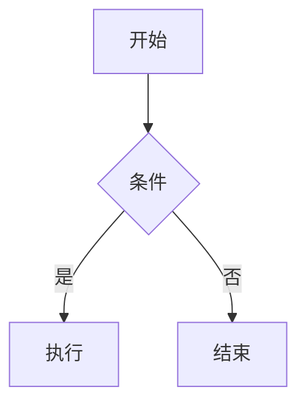

# 验收文档

## 公式

质能方程 $E=mc^2$，块级：

$$
\int_0^1 x^2 \, dx = \frac{1}{3}
$$

## Mermaid

```mermaid
graph TD
  A[开始] --> B{条件}
  B -->|是| C[执行]
  B -->|否| D[结束]
```

## GFM

- [x] 已完成事项
- [ ] 待办事项

| 列 A | 列 B |
|------|------|
| 1 | 2 |

~~删除线~~ 与 https://example.com 自动链接。
